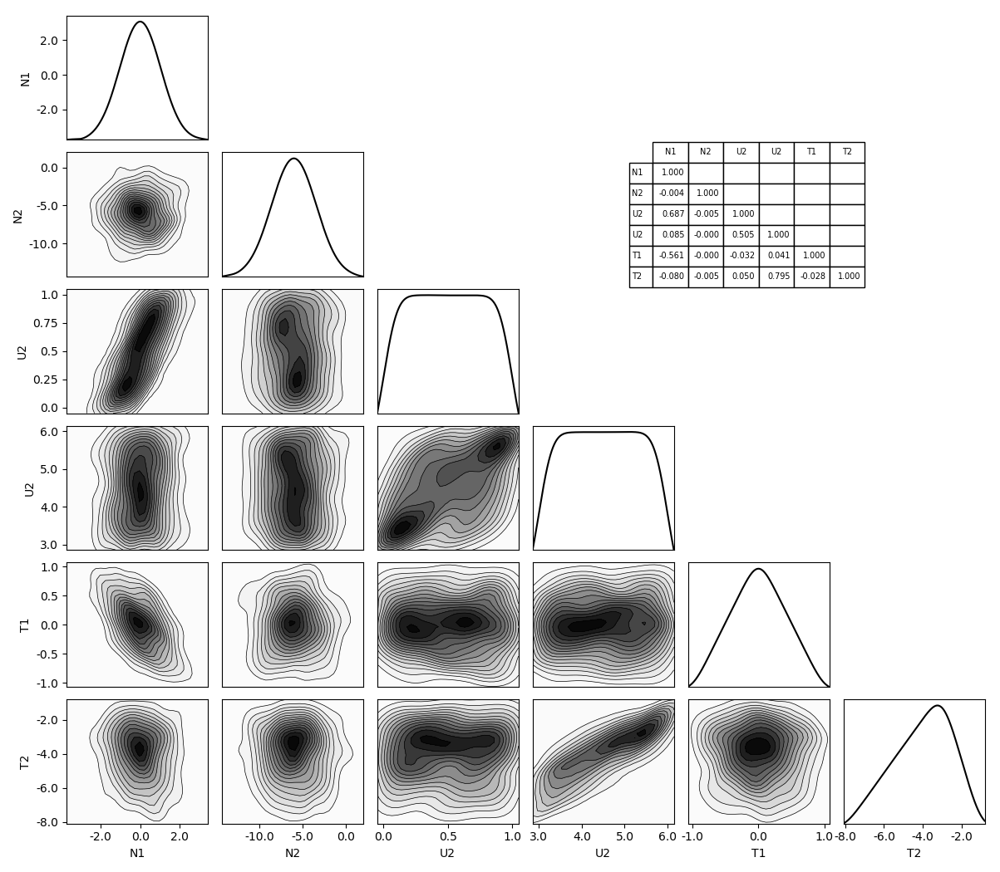

# LHS with Correlation

This simple example shows how to enforce correlation in the samples. The samples may come for different distributions; not just gaussian.

In this example, we are only really interested in the sampling strategy and therefor just use a `random.sh` analysis driver.

## Final Sample

Dakota will try to match the specified *rank* correlations: (direct from Dakota without the "random" field)

```
N1           N2           U1           U2           T1               T2
N1  1.00000e+00
N2 -1.55108e-02  1.00000e+00
U1  6.99819e-01 -1.66892e-02  1.00000e+00
U2  7.66353e-02 -8.69437e-03  5.05194e-01  1.00000e+00
T1 -5.20771e-01  8.55632e-03 -2.43888e-02  4.11428e-02  1.00000e+00
T2 -9.13214e-02 -4.27298e-03  5.65832e-02  8.03016e-01 -2.40233e-02  1.00000e+00
```

However, you can also measure the "Pearson product-moment correlation coefficients" (`corrcoef` in Matlab or NumPy)

```
N1           N2           U1           U2           T1               T2       
N1  1.00000e+00
N2 -4.00547e-03  1.00000e+00
U1  6.87319e-01 -4.58694e-03  1.00000e+00
U2  8.45162e-02 -4.56688e-04  5.05101e-01  1.00000e+00
T1 -5.60694e-01 -1.67176e-04 -3.19050e-02  4.12220e-02  1.00000e+00
T2 -8.02097e-02 -5.12579e-03  4.97753e-02  7.95449e-01 -2.75585e-02  1.00000e+00
```

Finally, we can plot this all (see `plot_samples_kdes.py`



### Additional Tip: Cleanup

Dakota creates many temporary files that do not need to remain. The following will remove them

    $ rm LHS_[123456789].out LHS_distributions.out LHS_samples.out
    $ rm dakota.rst # if you do not need it.
    
