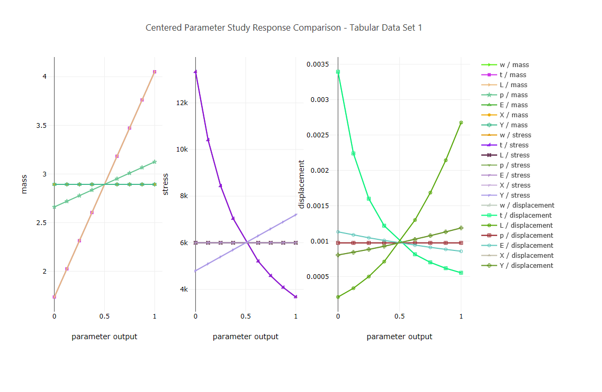

# Summary
A parametric exploration of a cantilever beam, starting from a center point.

# Description

This Dakota study examines a cantilever beam, which is a beam that is only anchored at one end.  When subjected to a load, the cantiver carries the load to the support, where it is forced against by a moment and shear stress.  Cantilever construction allows for overhanging structures without external bracing. 

This simulation of a cantilever beam calculates three quantities of interest - mass, stress, and displacement.

### Mass

$` f(l,w,t,p) = \frac{t * w * p * l}{12^3} `$

### Stress

$` f(w,t,x,y) = \frac{600}{t^2 * w * y} + \frac{600}{w^2 * t * x} `$

### Displacement

$` f(l,w,t,p,e,x,y) = \frac{4 * l^3}{t * w * e} * \sqrt{(\frac{y}{t ^ 2})^2 + (\frac{x}{w ^ 2})^2} `$

where:
 - **l** = length
 - **w** = width
 - **t** = thickness
 - **p** = density
 - **e** = Young's modulus
 - **x** = horizontal load
 - **y** = vertical load

# How to run the example
    $ dakota -i dakota_cantilever_center.in -o dakota_cantilever_center.out
 
# Requirements

This example uses a shell script as its driver, which assumes a Unix-based operating system.
If you are running this example on Windows:
- Be sure to launch Dakota in an environment that supports shell scripts.  Cygwin is a popular option.  Windows' own PowerShell is also tolerant of shell scripts.
- The keyword `link_files` must be changed to `copy_files.`
- The keyword `fork` must be changed to `system.`

See the "Description of analysis driver" section for more information about the analysis driver.

# Contents

- `cantilever` - the black-box simulation model representing the cantilever beam.  In reality, this is a Python script with the extension removed, so it would be invoked from the command-line as python cantilever <input file>, where <input file> is the input data file for the simulation.
- `cantilever.i` - the original, untemplatized input file for the cantilever beam.  A pre-processing program (such as aprepro, dprepro, or pyprepro) would be responsible for marking this file with pre-processing syntax and produce a result similar to what is seen in the `cantilever.template` file.
- `cantilever.template` - the templatized input file for the cantilever beam.  Note the presence of curly braces in the text of this file.  This file is primarily used in the pre-processing step of analysis driver logic.
- `dakota_cantilever_center.in` - the Dakota study, which uses the centered_parameter_study method to study the cantilever beam model.
- `driver.sh` - the analysis driver for the Dakota study.  See the section below for more information about the analysis driver.
 
# Description of analysis driver
The analysis driver "driver.sh" is a simple shell script that performs the three steps required of a Dakota analysis driver:

- **Pre-processing:**  Pre-processing is handled by `dprepro`, a Python library for pre-processing that is shipped with Dakota.  The file "cantilever.template" (already marked up with dprepro syntax) has variables replaced at runtime by Dakota, and then is written to "cantilever.i".
- **Execution:** The cantilever simulation is executed as a command-line script.
- **Post-processing:**  "tail", "head", and "awk" are used to extract quantities of interest from the simulation's output stream.

# Interpreting the results

The output of the Dakota run is written to the file named "dakota\_cantilever\_center.out".  In addition, because of the
specification of the keyword `tabular_data`, the variables and responses at each iteration of Dakota will be written to 
a tabular data file called 'dakota_tabular.dat,' which can then be read by graphical plotting software for
visualizing the exploration of the parameter space.

 
_In this set of plots, each response is given its own plot, while each variable is normalized between 0 and 1 to show
 the effects of varying that variable on the given response.  This plot was generated using plotly.js via the Dakota GUI._

# Further Reading

[Learn more about the centered\_parameter\_study method.](https://snl-dakota.github.io/docs/latest_release/users/usingdakota/reference/method-centered_parameter_study.html)
