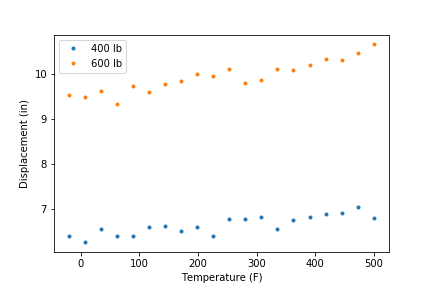

# Deterministic Calibration Examples

## Intent
In (deterministic) calibration, the parameters of a model are adjusted with the goal that its predictions more closely match experiment or perhaps predictions from a higher fidelity model. Dakota uses optimization, such as the nl2sol method, to minimize the errors between model predictions and experiment in a least squares sense.

The examples in this folder demonstrate how to pose calibration problems to Dakota. They explore use of scalar and field calibration terms, replicated experiments, experiments at multiple configurations, and experimental data with uncertainty. Emphasis is placed on guiding users through creating a Dakota input file and placing their (optional) experimental data into the format required by Dakota. The examples do not provide advice about formulating a good calibration problem (e.g. should I smooth my experimental data?).

## Examples
There are five examples that all solve a similar calibration problem. The first three examples use scalar calibration terms, and the last two use a field calibration term. (Field terms offer two main benefits over scalar terms. First, field terms allow the entire covariance matrix between points in the field to be specified as uncertainty. Second, Dakota has a limited ability to perform linear interpolation between field terms and experimental data. In addition, some users may find the way experimental data is presented to Dakota for field terms more convenient than for scalar terms.)

The distinguishing features of the five examples are summarized in the table below.

| Example Folder                    | Characteristics                                                                            |
|:---------------------------------:|:------------------------------------------------------------------------------------------:|
| `scalar_residual`                 | Scalar calibration terms; Analysis driver returns residuals                                |
| `scalar_multiexperiment_noconfig` | Scalar calibration terms; Replicated experiments with uncertainty                          |
| `scalar_multiexperiment_config`   | Scalar calibration terms; Experiments under different conditions (configuration variables) |
| `field_no_interp`                 | Field calibration terms                                                                    |
| `field_interpolate`               | Field calibration terms with interpolation                                                 |

## The Calibration Problem

The model to be calibrated predicts the dependence of the Young’s modulus E of carbon steel on temperature. Over a wide range of temperature, this relationship is linear to a very good approximation:

`E(T) = E0 + Es*T`

The parameters E0 and Es are to be calibrated. We don’t have experimental values of E(T). Rather, experiments were performed on a carbon steel cantilever beam with a rectangular cross section. The beam was placed under two vertical loads, 400 lbs and 600 lbs, and the displacement at the free end was measured at a sequence of temperatures between -20 F and 500 F. The measurements are imprecise and have a known standard deviation.

The displacement of a rectangular cantilever beam has a well-known, closed-form result that depends on E. The scripts `cantilever.py` and `cantilever_residual.py` implement this formula. They accept Dakota parameter files as input, and expect to find the calibration parameters E0 and Es, as well as the vertical load Y. (`cantilever.py` also requires the number of temperatures at which to compute the displacement as an analysis component.) The write, in Dakota results format, either the displacement (in the case of cantilever.py) or the residuals (for `cantilever_residuals.py`) at evenly spaced temperatures between -20F and 500F. (The number of temperature steps is specified in the Dakota input file as an analysis component).
