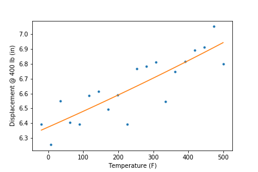

# Summary

Calibrate a model using an analysis driver that computes residuals

# Description

A simple cantilever beam simulation is used to demonstrate how to pose
a calibration problem to Dakota when the analysis driver returns one or
more *residuals*. A residual is defined as the difference, for particular
values of model input parameters, between a model prediction and experimental 
data. That is, the residual $`r_i(\theta)`$ for the $`i`$th experimental 
observation $`m_i`$ and model input parameters $`\theta`$, is defined as:
```math
r_i(\theta) = \hat{y}_i(\theta) - m_i
```
In this expression, $`\hat{y}_i(\theta)`$ is the prediction of the model to be
calibrated at conditions corresponding to $`m_i`$.

This is the simplest form of calibration study from the perspective of
Dakota setup, because it does not require the user to provide experimental
data to Dakota.

# Calibration Problem

Over a wide range of temperature, the Young's modulus $`E`$ of carbon
steel is linearly related to temperature:
```math
E(T) = E0 + Es \cdot T
```

The parameters $`E0`$ and $`Es`$ are to be calibrated.

We don’t have direct experimental measurements of $`E(T)`$. Rather, an
experiment was performed on a carbon steel cantilever beam. The beam was
placed under a vertical load and the displacement of the tip, which depends
on $`E(T)`$, was measured at a series of temperatures. Dakota will use a
cantilever beam model that incorporates the linear model for $`E(T)`$ to
determine the values of $`E0`$ and $`Es`$ that result in the closest fit
between the measured and predicted tip displacements.

# Analysis Driver

The analysis driver for this study is the script `cantilever_residual.py`.
It has three inputs:

* $`Y`$: The vertical load. It's fixed at 400 lbs for this example using a
  `continuous_state` variable.
* $`E0`$ and $`Es`$: the parameters being calibrated, the intercept
  and slope of the linear Young's modulus model. These are `continuous_design`
  variables in the Dakota input file.

The driver contains experimentally measured displacements at
20 evenly spaced temperatures between -20&deg;F and 500&deg;F (`d_exp`,
defined beginning on line 20). When called by Dakota, it predicts 
displacements at each temperature, differences them with
the measured displacements to calculate residuals, and returns the
residuals to Dakota. Twenty `calibration_terms` are specified in 
the `responses` section of the Dakota input file for the 20 residuals.


# How to run the example
 
Run Dakota

    $ dakota -i dakota_cal.in -o dakota_cal.out
 
# Requirements

Python 2 or 3 with numpy

# Contents

* `dakota_cal.in`: Dakota input file
* `cantilever_residuals.py`: Combined simulator and analysis driver

# Study Results 
## Screen Output

Dakota produces output similar to the following to the screen (redirected to 
`dakota_cal.out`).

~~~~
<<<<< Best parameters          =
                      2.9746942319e+07 E0
                     -4.8549276396e+03 Es
                      4.0000000000e+02 Y
<<<<< Best residual terms =
                     -3.9899798878e-02
                      1.2555616568e-01
                     -1.3761186985e-01
                      3.6109300635e-02
                      7.6073005896e-02
                     -8.5547721206e-02
                     -8.3651732254e-02
                      6.5081748234e-02
                     -1.0345456506e-03
                      2.2389234039e-01
                     -1.1630826751e-01
                     -1.0144551970e-01
                     -9.8547611264e-02
                      1.9792754972e-01
                      2.8208234047e-02
                     -6.4321667630e-03
                     -4.7806178509e-02
                     -3.7230652331e-02
                     -1.4151845265e-01
                      1.4418573491e-01
<<<<< Best residual norm =  4.7968348487e-01; 0.5 * norm^2 =  1.1504812283e-01
<<<<< Best evaluation ID: 22

Confidence Intervals on Calibrated Parameters:
            E0: [ 2.9310006145e+07, 3.0183878493e+07 ]
            Es: [ -6.3036287757e+03, -3.4062265035e+03 ]

~~~~

Dakota reports several pieces of information, including

* The best parameters (those that minimize the sum of the squared errors)
* The best residuals
* The norm of the best residuals
* The evaluation ID of the best parameters/residuals
* Confidence intervals on the calibrated parameters
 
---

The points in the figure below are experimental data, and the line is the
calibrated model.


 
---
