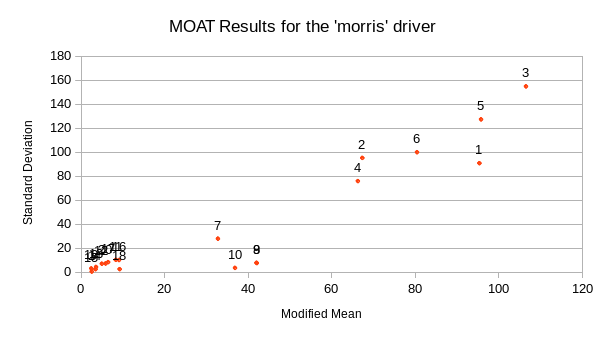

# Summary
Global sensitivity analysis using Morris One-At-A-Time (MOAT)
 
### Run Dakota
    $ dakota -i dakota_moat.in -o moat.out
 
### More about running this example
This example uses the `morris` driver in the `share/dakota/test` folder.
To run the example, either this folder must be added to your system's PATH,
or the `morris` driver must be placed alongside `dakota_moat.in`.
 
# What problem does this solve?

The Morris One-At-A-Time (MOAT) method for global sensitivity analysis is a
screening method designed to distinguish between input variables that have
negligible effect, those that have a linear effect, and those
that have a nonlinear effect or interaction effects on a response.

As MOAT runs, it adjusts one randomly-selected variable at a time in large
steps to compute elementary effects (see definitions below). Statistics on 
the elementary effects provide sensitivity information.

## Math Equation

MOAT randomly varies one input factor at a time to create a sample of 
its elementary effects.

Each dimension of a $`k-`$dimensional input space is
uniformly partitioned into $`p`$ levels, creating a grid of $`p^k`$ points
$`{\bf x} \in \mathbb{R}^k`$ at which evaluations of the model $`y({\bf
x})`$ might take place. An elementary effect corresponding to input
$`i`$ is computed by a forward difference

$`\qquad d_i({\bf x}) = \frac{y({\bf x} + \Delta {\bf e}_i) - y({\bf x})}{\Delta}`$,

where $`e_i`$ is the $`i`$th coordinate vector, and
the step $`\Delta`$ is typically taken to be large (this is not intended
to be a local derivative approximation). In the present
implementation of MOAT, for an input variable scaled to $`[0,1]`$,
$`\Delta = \frac{p}{2(p-1)}`$, so the step used to find elementary
effects is slightly larger than half the input range.

The distribution of elementary effects $`d_i`$ over the input space
characterizes the effect of input $`i`$ on the output of interest.
After generating $`r`$ samples from this distribution, their mean,

$`\qquad \mu_i = \frac{1}{r}\sum_{j=1}^{r}{d_i^{(j)}}`$,

modified mean

$`\qquad \mu_i^* = \frac{1}{r}\sum_{j=1}^{r}{|d_i^{(j)}|}`$,

(using absolute value) and standard deviation

$`\qquad \sigma_i = \sqrt{ \frac{1}{r}\sum_{j=1}^{r}{ \left(d_i^{(j)} - \mu_i
\right)^2} }`$

are computed for each input $`i`$. The mean and modified mean give an
indication of the overall effect of an input on the output. Standard
deviation indicates nonlinear effects or interactions, since it is an
indicator of elementary effects varying throughout the input space.

# What method will we use?

In Dakota, the `psuade_moat` method is used for MOAT analysis. Like
`sampling`, MOAT can handle problems that are non-smooth. It may be
preferable to `sampling` in some situations because it can provide
richer and easier to interpret results Than correlation
analysis. Because `psuade_moat` runs the model at randomly selected
locations on a structured grid in parameter space, the raw evaluation
data may not be ideal for reuse for some purposes, such as surrogate
construction.

## Analysis Driver

The `morris` driver is a screening design test problem with a
single-output analytical test function. A description of the `morris`
driver is provided in section 20.9 of the User's Manual.

### Inputs

Briefly, it has 20 inputs that express first- through fourth-order
interaction terms, some having large fixed coefficients and others
small random coefficients. It is designed in such a way that the first
ten inputs are important. Of these, the first seven have significant
effects involving either interactions or curvatures, and the other
three are important mainly because of their first-order effect.

### Outputs

The `morris` driver returns one output.

# Interpret the results
 
## Screen Output

Screen output for this example is redirected to the file `moat.out`.

After running 84 samples to compute elementary effects, Dakota lists the
modified means and standard deviations for each of the 20 variables:

~~~~
>>>>>> PSUADE MOAT output for function 0:

*************************************************************
*********************** MOAT Analysis ***********************
-------------------------------------------------------------
Input   1 (mod. mean & std) =   9.5329e+01   9.0823e+01 
Input   2 (mod. mean & std) =   6.7297e+01   9.5242e+01 
Input   3 (mod. mean & std) =   1.0648e+02   1.5479e+02 
Input   4 (mod. mean & std) =   6.6231e+01   7.5895e+01 
Input   5 (mod. mean & std) =   9.5717e+01   1.2733e+02 
Input   6 (mod. mean & std) =   8.0394e+01   9.9959e+01 
Input   7 (mod. mean & std) =   3.2722e+01   2.7947e+01 
Input   8 (mod. mean & std) =   4.2013e+01   7.6090e+00 
Input   9 (mod. mean & std) =   4.1965e+01   7.8535e+00 
Input  10 (mod. mean & std) =   3.6809e+01   3.6151e+00 
Input  11 (mod. mean & std) =   8.2655e+00   1.0311e+01 
Input  12 (mod. mean & std) =   4.9299e+00   7.0591e+00 
Input  13 (mod. mean & std) =   3.5455e+00   4.4025e+00 
Input  14 (mod. mean & std) =   3.4151e+00   2.4905e+00 
Input  15 (mod. mean & std) =   2.5143e+00   5.5168e-01 
Input  16 (mod. mean & std) =   9.0344e+00   1.0115e+01 
Input  17 (mod. mean & std) =   6.4357e+00   8.3820e+00 
Input  18 (mod. mean & std) =   9.1886e+00   2.5373e+00 
Input  19 (mod. mean & std) =   2.4105e+00   3.1102e+00 
Input  20 (mod. mean & std) =   5.8234e+00   7.2403e+00 
~~~~

These are plotted below, standard deviation versus modified mean,
for easier interpretation. The points are labeled by variable ID,
1 through 20. Generally, larger modified means indicate greater 
influence. Larger standard deviations indicate the presence of
nonlinear effects or interactions among variables. 

Examination of the test function (see section 20.9 of User's Manual) reveals 
that one should be able to conclude the following for this test problem:

1. the first ten factors are much more important than variables 11-20;
2. of these, the first seven have significant effects involving either interactions 
   or curvatures; and
3. the other three, inputs 8 and 9, which are overlapping, and 10, are important 
   mainly because of their first-order (linear) effect.

The plot is consistent with these observations.

---

 
 
