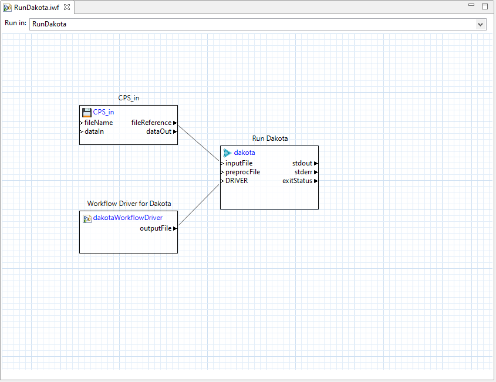

# Summary

This is an example that studies a cantilever beam model using a Dakota centered parameter study.  Dakota and the cantilever beam model are connected via Next-Gen Workflow files, which must be executed in Dakota GUI.

# Description of model

The black-box simulation model used in this example is a *cantilever beam*, which can be thought of as a rigid structural element that extends horizontally and is supported at only one end.

The simulation model accepts seven input parameters:

 - the length of the beam, **L**
 - the width of the beam, **w**
 - the thickness of the beam, **t**
 - Young's modulus, **E**
 - the density of the beam, **p**
 - the horizontal load on the beam, **X**
 - the vertical load on the beam, **Y**

The simulation model produces three output responses:

 - the **mass** of the beam
 - the **stress** on the beam
 - the **displacement** of the beam

This problem is emblematic of most Dakota studies, in that we have a simulation model that takes input parameters and produces output responses, and we would like to use Dakota to study that model.

# Description of analysis driver

Dakota does not know how to set up, run, or get output from a user's simulation.  The user is responsible for creating a driver that carries out those tasks on Dakota's behalf. In a typical study, Dakota runs the driver one time for each evaluation, which is a mapping from a single point in input/parameter space to a corresponding point in response/output space.  The driver has three main responsibilities.

1. **Preprocessing:** Dakota provides parameter values to the driver by writing them to a parameters file.  It communicates the name of the parameters file as the first command line argument of the driver. In the preprocessing phase, the driver uses values it reads from the parameters file to construct valid input for the simulation.

2. **Execution:** The driver runs the user's simulation.

3. **Postprocessing:** In this phase, the driver extracts response information from simulation output and writes it to a correctly formatted Dakota results file. Dakota provides the name of the results file as the second command line argument to the driver.

Because Dakota does not directly interpret the driver and relies on the operating system and other tools on the user's system to execute it, the driver can be written in any programming language.  This example demonstrates a driver that was written using the Next-Gen Workflow software tool provided within Dakota GUI.

# Contents

- `RunDakota.iwf` - the top-level workflow that is responsible for running Dakota.  **You should start here if you would like to execute this example in Dakota GUI.**
- `WorkflowDriver.iwf` - the "inner" workflow that passes information from Dakota to the black-box simulation model.  This workflow functions as Dakota's analysis driver. 
- `cantilever` - the black-box simulation model representing the cantilever beam.  In reality, this is a Python script with the extension removed, so it would be invoked from the command-line as `python cantilever <input file>`, where <input file\> is the input data file for the simulation.
- `cantilever.template` - the templatized input file for the cantilever beam.  Note the presence of curly braces in the text of this file.  This file is primarily used in the **pre-processing** step of analysis driver logic.
- `CantileverBeam.bmf` - a lightweight model definition for the cantilever beam.  This BMF model contains seven input parameters and three output responses.  BMF stands for "basic model format", and these files are generated/used in Dakota GUI.
- `CPS.in` - the Dakota study, which uses the `centered_parameter_study` method to study the cantilever beam model.  Note that the `analysis_driver` keyword in the `interface` block of the Dakota study is "\{DRIVER\}". The curly braces indicate pre-processing markup that must be replaced by another process.  This is the responsibility of *RunDakota.iwf.*
- `externalProcess.log` - an example output log produced by running the cantilever black-box simulation.  This file could be generated by piping the standard output stream from `python cantilever <input file>` to a log file (for example:  `python cantilever <input file> > externalProcess.log`).  The information captured in this log is primarily used in the **post-processing** step of analysis driver logic.

# How to run the example

## Prerequisites

Make sure Dakota's bin directory is available on your system path.  For example, if you installed Dakota to `/home/dakota`, then `/home/dakota/bin` should be accessible on your system path.  The bin directory contains the _dprepro_ pre-processing utility, which is used by _WorkflowDriver.iwf_.  Additionally, the _dakota_ node in _RunDakota.iwf_ has no explicit path to Dakota set, which means the workflow will try to locate Dakota on your system path.

## Run in Dakota GUI

After importing this example project into the GUI, double-click RunDakota.iwf to open the top-level workflow, which will look something like this:

To run a workflow, you can click one of the two play buttons displayed in the ribbon along the top of the screen:

The first play button (the green triangle in front of the folder icon) will allow you to specify the working directory for the workflow.  The second play button (the plain green triangle) will run the workflow in the last-used run directory; if this is your first time running a workflow, Dakota GUI will create a new directory named after the workflow file and run the workflow inside that directory. 

# Further Reading

This example was developed from the example available at `dakota-examples/official/gui/analysis_driver_tutorial/begin`, using the following steps to produce workflow files:

 - [Create an empty driver workflow using the Workflow-Based Dakota Driver wizard.](https://dakota.sandia.gov/content/wizards-1#workflow-based-dakota-driver)
 - [Design a workflow that will execute your simulation model.](https://dakota.sandia.gov/content/next-gen-workflow-1#nested-workflow-tutorial)
 - [Create a new Dakota study using the Dakota Study Wizard, providing your workflow as the analysis driver.](https://dakota.sandia.gov/content/wizards-1#dakota-study-wizard)
 - [Create an outer wrapper workflow that will run Dakota.](https://dakota.sandia.gov/content/wizards-1#dakota-wrapper-workflow-wizard)
