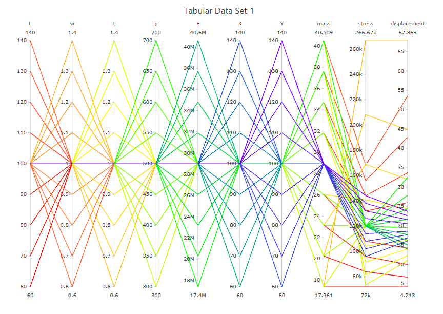

# Summary

This example demonstrates a parallel coordinates plot of data from a cantilever beam study.  The parallel coordinates plot was produced using Dakota GUI.

# Description

A cantilever beam can be thought of as a rigid structural element that extends horizontally and is supported at only one end.

The cantilever beam model has seven input parameters:

 - the length of the beam, **L**
 - the width of the beam, **w**
 - the thickness of the beam, **t**
 - Young's modulus, **E**
 - the density of the beam, **p**
 - the horizontal load on the beam, **X**
 - the vertical load on the beam, **Y**

The cantilever beam model produces three output responses:

 - the **mass** of the beam
 - the **stress** on the beam
 - the **displacement** of the beam

# Contents

- `CPS.in` - the original Dakota input file that studies the cantilever beam model, using a *centered\_parameter\_study* method.  This is a modified version of the example available at `official/gui/analysis_driver_tutorial/complete_python_driver` in the Dakota examples repository.  Refer to that example if you would like to run this study.
- `tabular.dat` - a Dakota tabular data file, previously produced by running the `CPS.in` input file provided with this example. 
- `TabularDataSet1.plot` - a previously-generated plot file representing data from the cantilever beam.  This plot is viewable in Dakota GUI.

# How to run the example

- Open Dakota GUI.
- Import this example into your workspace.
- Double-click the TabularDataSet1.plot file to view the plot.

# How to create a new plot

- Open Dakota GUI.
- Import this example into your workspace.
- Right-click the rosen_multidim.dat tabular data file, and choose `Chartreuse > New plot trace from this file.`
 - You should see the Plot Trace Creator dialog open, with your tabular data pre-selected as "Tabular Data Set 1."
- Choose "Parallel Coordinates Plot" from the "Plot Type" dropdown menu.
- The only thing you need to specify for this type of plot is the color scale.  You can specify this manually by adding colors one at a time, but we recommend selecting a pre-defined color scale template (use the wand icon docked in the bottom-right part of the "Color Scale Settings" area).
- When you're finished, click OK.
- Your new plot file should auto-open in the main editor area of Dakota GUI.

# Further Reading

- [Read about parallel coordinates plots.](https://en.wikipedia.org/wiki/Parallel_coordinates)
- [Learn how to interactive manipulate parallel coordinates plots produced by Dakota GUI.](https://plotly.com/javascript/parallel-coordinates-plot/)
- [Read in the Dakota GUI manual about other types of plots that can be produced.](https://dakota.sandia.gov/content/chartreuse-1)