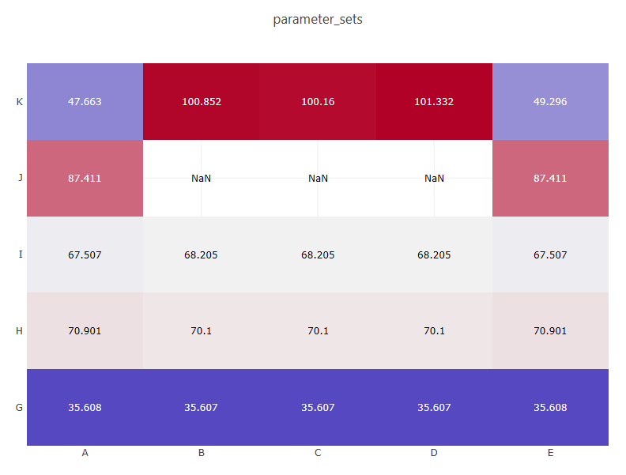

# Summary

This example demonstrates a heatmap displaying categorical data from a Dakota study.  The bar chart was produced using Dakota GUI.

# Description

The dataset provided with this example represents a Dakota study that originally had a single variable **F**.  The variable F had five discrete states - **A, B, C, D,** and **E.**  The original study also contained five output responses that were measured - **G, H, I, J** and **K.**  The plot shown above describes the values of responses G through K at each of the five discrete variable states A through E.

# Contents

- `Heatmap_parameter_sets.plot` - the plot that demonstrates categorical heatmaps, shown above.  The name describes both the type of plot (Heatmap) and the HDF5 dataset from which the data originated (parameter\_sets).
- `dataset.h5` - The original HDF5 database file that contains the results of the Dakota study.

# How to run the example

- Open Dakota GUI.
- Import this example into your workspace.
- Double-click the Heatmap_parameter_sets.plot file to view the plot.

# How to create a new plot

- Open Dakota GUI.
- Import this example into your workspace.
- Right-click the dataset.h5 file, and choose `Chartreuse > New plot trace from this file.`
- Click on the "Get Data" button (the folder-and-file icon) to choose an HDF5 dataset to plot.
- In the "Select Plot Data" dialog that opens, select "PARAMETER\_SETS" from the "HDF Target Object" dropdown.  You should see the dialog locate the parameter\_sets dataset within the HDF5 hierarchy on the right side of the dialog.
- Type "F" in the "Discrete State Set Variable" dialog to indicate that we are interested in plotting F for our categorical bar chart.

- Click OK to close the dialog.
- Choose "Heatmap (Categorical Data)" from the "Plot Type" dropdown menu.
- Choose "Variable-Response" in the "Orientation" dropdown menu.  You may choose any orientation, but "Variable-Response" will mimic the plot shown above.
- Specify a color scale for the heatmap.  You can specify this manually by adding colors one at a time, but we recommend selecting a pre-defined color scale template (use the wand icon docked in the bottom-right part of the "Color Scale Settings" area).  The color scale shown above is "Bent Cool Warm."
- When you're finished, click OK.
- Your new plot file should auto-open in the main editor area of Dakota GUI.

# Further Reading

- [Read in the Dakota GUI manual about other types of plots that can be produced.](https://dakota.sandia.gov/content/chartreuse-1)
- [Learn about discrete variables in Dakota.](https://dakota.sandia.gov//sites/default/files/docs/latest_release/html-ref/topic-discrete_variables.html)
- [Read about ideal color scales for visualizing data.](http://www.kennethmoreland.com/color-advice/)