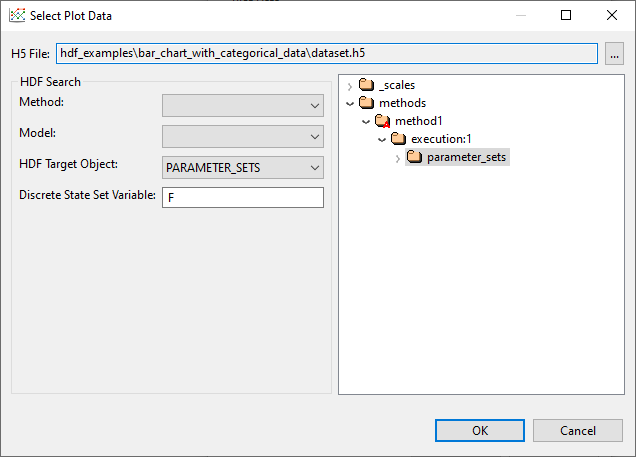

# Summary

This example demonstrates a scatter plot displaying categorical data from a Dakota study.  The scatter plot was produced using Dakota GUI.

# Description

The dataset provided with this example represents a Dakota study that originally had a single variable **F**.  The variable F had five discrete states - **A, B, C, D,** and **E.**  The original study also contained five output responses that were measured - **G, H, I, J** and **K.**  The plot shown above describes the value of responses G through K, each located at the discrete state of A.

# Contents

- `ScatterPlot_CategoricalData_parameter_sets.plot` - the plot that demonstrates categorical scatter plots, shown above.  The name describes both the type of plot (ScatterPlot\_CategoricalData) and the HDF5 dataset from which the data originated (parameter\_sets).
- `dataset.h5` - The original HDF5 database file that contains the results of the Dakota study.

# How to run the example

- Open Dakota GUI.
- Import this example into your workspace.
- Double-click the ScatterPlot\_CategoricalData-parameter\_sets.plot file to view the plot.

# How to create a new plot

- Open Dakota GUI.
- Import this example into your workspace.
- Right-click the dataset.h5 file, and choose `Chartreuse > New plot trace from this file.`
- Click on the "Get Data" button (the folder-and-file icon) to choose an HDF5 dataset to plot.
- In the "Select Plot Data" dialog that opens, select "PARAMETER\_SETS" from the "HDF Target Object" dropdown.  You should see the dialog locate the parameter\_sets dataset within the HDF5 hierarchy on the right side of the dialog.
- Type "F" in the "Discrete State Set Variable" dialog to indicate that we are interested in plotting F for our categorical scatter plot.

- Click OK to close the dialog.
- Choose "Scatter Plot (Categorical Data)" from the "Plot Type" dropdown menu.
- Choose "A [Variable]" in the "Data" dropdown menu.
- Choose "Vertical" in the "Orientation" dropdown menu.
- You may optionally specify a color for the scatter plot.
- When you're finished, click OK.
- Your new plot file should auto-open in the main editor area of Dakota GUI.

# Further Reading

- [Read in the Dakota GUI manual about other types of plots that can be produced.](https://dakota.sandia.gov/content/chartreuse-1)
- [Learn about discrete variables in Dakota.](https://dakota.sandia.gov//sites/default/files/docs/latest_release/html-ref/topic-discrete_variables.html)