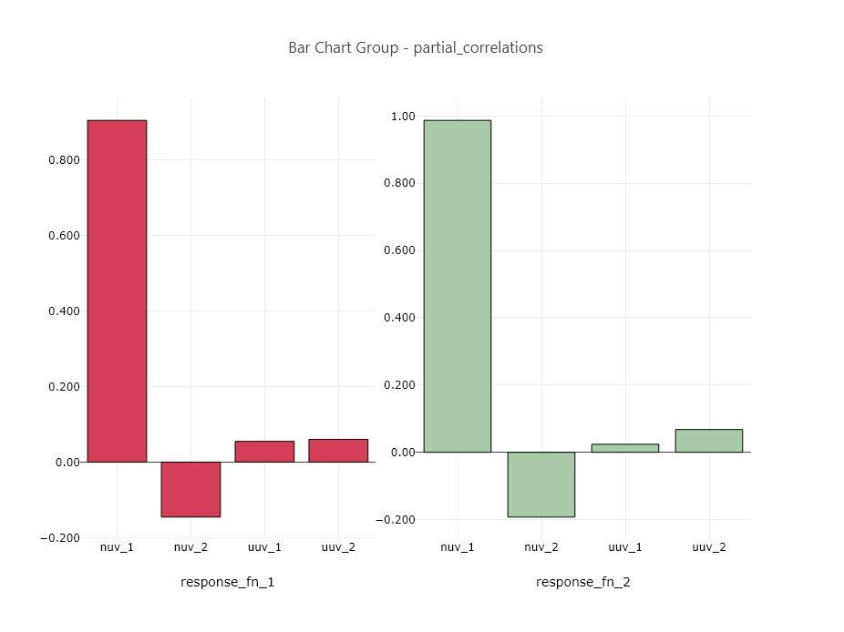

# Summary

This example demonstrates a bar chart plot of an LHS (Latin hypercube) study from Dakota.  The bar chart was produced using a plotting template in Dakota GUI.

# Description

After running a Dakota LHS study and producing an HDF5 dataset file, many useful datasets will be produced.  Among them are correlations between the variables and responses.  The bar chart group shown above demonstrates how the Dakota input variables (nuv\_1, nuv\_2, uuv\_1, and uuv\_2) and correlated to the Dakota output responses response\_fn\_1 and response\_fn\_2.

# Contents

- `BarChartGroup-partial_correlations.plot` - the plot that demonstrates partial correlation bar charts, shown above.  The name describes both the type of plot (BarChartGroup) and the HDF5 dataset from which the data originated (partial\_correlations).
- `basic_lhs.h5` - The original HDF5 database file that contains the results of the Dakota study.

# How to run the example

- Open Dakota GUI.
- Import this example into your workspace.
- Double-click the BarChartGroup-partial_correlations.plot file to view the plot.

# How to create a new plot

- Open Dakota GUI.
- Import this example into your workspace.
- Right-click the dataset.h5 file, and choose `Chartreuse > New plot template from this file`.
- Choose "Bar Chart Variable Comparison" from the "Select Template" dropdown.
- Click on the "Get Data" button (the folder-and-file icon) to choose an HDF5 dataset to plot.
- In the "Select Plot Data" dialog that opens, select "PARTIAL\_CORRELATIONS" from the "HDF Target Object" dropdown.  You should see the dialog locate the partial\_correlations dataset within the HDF5 hierarchy on the right side of the dialog.

- Click OK to close the dialog.
- Choose "Horizontal" from the "Choose canvas orientation" dropdown.
- Choose "Vertical" from the "Choose bar orientation" dropdown.
- Choose "Response" from the "Create canvas by" dropdown.
- When you're finished, click OK.
- Your new plot file should auto-open in the main editor area of Dakota GUI.

# Further Reading

- [Read in the Dakota GUI manual about other types of plots that can be produced.](https://dakota.sandia.gov/content/chartreuse-1)
- Learn about [simple correlation](https://en.wikipedia.org/wiki/Correlation_and_dependence), [rank correlation](https://en.wikipedia.org/wiki/Rank_correlation), and [partial correlation](https://en.wikipedia.org/wiki/Partial_correlation).