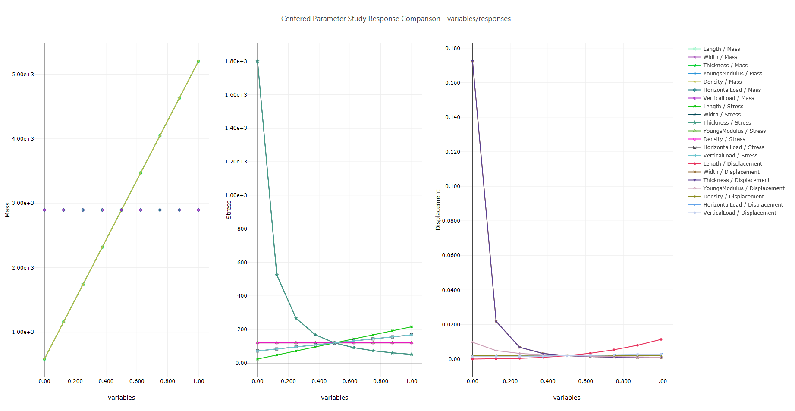

# Summary

This example demonstrates a "response comparison" set of plots, showing the differences between response output across the three responses of a centered parameter study of a cantilever beam model.  The plot was produced using a plotting template in Dakota GUI.

# Description

A cantilever beam can be thought of as a rigid structural element that extends horizontally and is supported at only one end.

The cantilever beam model has seven input parameters:

 - the length of the beam, **L**
 - the width of the beam, **w**
 - the thickness of the beam, **t**
 - Young's modulus, **E**
 - the density of the beam, **p**
 - the horizontal load on the beam, **X**
 - the vertical load on the beam, **Y**

The cantilever beam model produces three output responses:

 - the **mass** of the beam
 - the **stress** on the beam
 - the **displacement** of the beam

A Dakota `centered_parameter_study` method was applied to the cantilever beam model in the study plotted above, which meant each variable was explored in isolation over some finite range of values.  The study's output values were grouped by response and overlaid on top of each other, to demonstrate which variables produced the greatest change in value for each response. 

# Contents

- `CenteredParameterStudyResponseComparison-variables_responses.plot` - the plot that demonstrates centered parameter study response comparison, shown above.  The name describes both the type of plot (CenteredParameterStudyResponseComparison) and the HDF5 datasets from which the data originated (variables_responses).
- `CPS.in` - the original Dakota input file that studies the cantilever beam, using the *centered\_parameter\_study* method.
- `dakota_results.h5` - the HDF5 output from running the associated Dakota study.

# How to run the example

- Open Dakota GUI.
- Import this example into your workspace.
- Double-click the CenteredParameterStudyResponseComparison-variables_responses.plot file to view the plot.

# How to create a new plot

- Open Dakota GUI.
- Import this example into your workspace.
- Right-click the dakota_results.h5 file, and choose `Chartreuse > New plot template from this file`.
- Choose "Centered Parameter Study" from the "Select Template" dropdown.
- Click on the "Get Data" button (the folder-and-file icon) to choose an HDF5 dataset to plot.
- In the "Select Plot Data" dialog that opens, select either "VARIABLES" or "RESPONSES" from the "HDF Target Object" dropdown.  You should see the dialog locate the variables or responses dataset within the HDF5 hierarchy on the right side of the dialog, along with an informational message along the top of the dialog that states that both variables and responses datasets will be retrieved.
- Click OK to close the dialog.
- Choose "Horizontal" from the "Choose an orientation" dropdown.
- When you're finished, click OK.
- The main Plot Window Manager dialog will appear, showing you a preview of what your plot template will look like.  You can verify that there will be three side-by-side canvases - one for mass, one for stress, and one for displacement.
- If everything look good, click "Plot" in the lower-right corner of the dialog.
- Your new plot file should auto-open in the main editor area of Dakota GUI.

# Further Reading

- [Read in the Dakota GUI manual about other types of plots that can be produced.](https://dakota.sandia.gov/content/chartreuse-1)