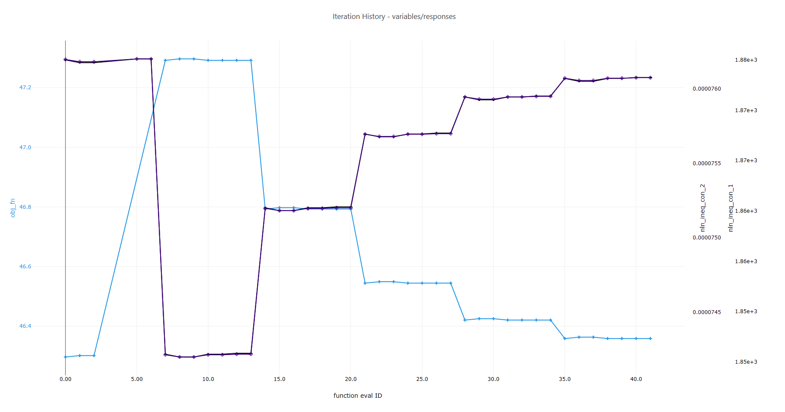

# Summary

This example demonstrates an "iteration history" plot.  An iteration history plot shows the value of each response as the Dakota study progressed.  This type of plot is useful for optimization studies, as we will see.  The plot was produced using a plotting template in Dakota GUI.

# Description

A cantilever beam can be thought of as a rigid structural element that extends horizontally and is supported at only one end.

The cantilever beam model has six input parameters:

 - the width of the beam, **w**
 - the thickness of the beam, **t**
 - the stress constraint value, **R** (see Dakota User's Manual for a further explanation)
 - Young's modulus, **E**
 - the horizontal load on the beam, **X**
 - the vertical load on the beam, **Y**

For this example, the cantilever beam model produces the following output:

 - the **mass** of the beam
 - the **stress** on the beam
 - the **displacement** of the beam

The `optpp_q_newton` optimization method was applied to the cantilever beam model in the study plotted above.  We treated "mass" as our objective function, while "stress" and "displacement" are treated as nonlinear inequality constraints.  The study's output responses were grouped together and displayed on overlapping, non-shared canvases.  This was done to demonstrate the relative optimization path that each response explored on the way to the optimal solution.  Separate canvases with different scales were used to display the output responses together at the same scale. 

# Contents

- `IterationHistory-variables_responses.plot` - The plot that demonstrates the iteration history template, shown above.  The name describes both the type of plot (IterationHistory) and the HDF5 datasets from which the data originated (variables_responses).
- `dakota_results.h5` - The HDF5 output from running Dakota's optpp\_q\_newton method on the cantilever beam model

# How to run the example

- Open Dakota GUI.
- Import this example into your workspace.
- Double-click the IterationHistory-variables_responses.plot file to view the plot.

# How to create a new plot

- Open Dakota GUI.
- Import this example into your workspace.
- Right-click the dakota_results.h5 file, and choose `Chartreuse > New plot template from this file`.
- Choose "Iteration History" from the "Select Template" dropdown.
- Click on the "Get Data" button (the folder-and-file icon) to choose an HDF5 dataset to plot.
- In the "Select Plot Data" dialog that opens, select either "VARIABLES" or "RESPONSES" from the "HDF Target Object" dropdown.  You should see the dialog locate the variables or responses dataset within the HDF5 hierarchy on the right side of the dialog, along with an informational message along the top of the dialog that states that both variables and responses datasets will be retrieved.
- Click OK to close the dialog.
- Choose "Horizontal" from the "Choose an orientation" dropdown.
- When you're finished, click OK.
- The main Plot Window Manager dialog will appear, showing you a preview of what your plot template will look like.  You can verify that there will be seven side-by-side canvases - one for each of the input variables, and one for the responses, overlaid together.
 - To emulate the plot image shown above and focus on responses only, you will need to delete the first six canvases from the generated plot template.  To do this, click on the "Edit this canvas" button located near the bottom of each canvas in the Plot Window Manager dialog.  Once that canvas has been given focus, click on the "Remove Column" button in the Canvas Viewer button bar above.  Repeat this step for each of the six canvases.  
- Once you are satisfied with the layout, click "Plot" in the lower-right corner of the dialog.
- Your new plot file should auto-open in the main editor area of Dakota GUI.

# Further Reading

- [Read in the Dakota GUI manual about other types of plots that can be produced.](https://dakota.sandia.gov/content/chartreuse-1)
- [Read about Dakota's optpp\\_q\\_newton method.](https://dakota.sandia.gov//sites/default/files/docs/latest_release/html-ref/method-optpp_q_newton.html)