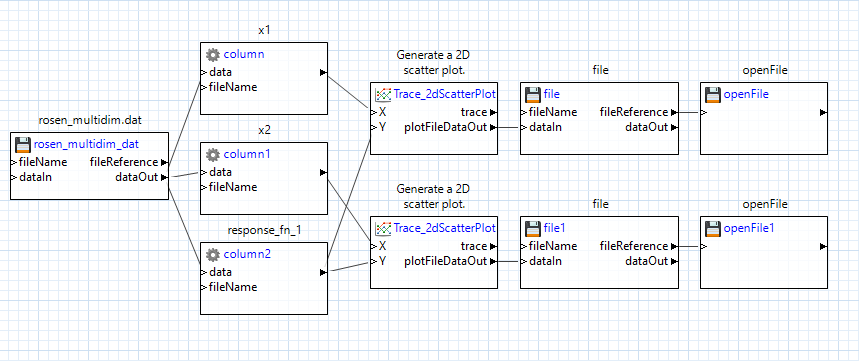

# Summary

This example demonstrates how to produce multiple plots simultaneously from the same dataset, using a workflow.  In this example, we use data from the Rosenbrock curve.  The workflow was created using Next-Gen Workflow, a tool provided in Dakota GUI.

 
# Contents

- `MultiplePlotExample.iwf` - a workflow file that extracts data from rosen_multidim.dat and creates two plots simultaneously.
- `rosen_multidim.dat` - a Dakota tabular data file, previously produced by running a Dakota input file that explored the Rosenbrock curve. 

# How to run the example

- Open Dakota GUI.
- Import this example into your workspace.
- Double-click MultiplePlotExample.iwf.
- Click on one of the two green play buttons in the action ribbon:

- The left play button allows you to define a custom location for running the workflow, while the right play button will run the workflow in the default location, which is a directory called "MultiplePlotExample", located in the same parent directory as MultiplePlotExample.iwf.
- After running, a new "MultiplePlotExample" directory will be created, and two new plots will be located inside.  Additionally, this workflow has been built to automatically open both new plot files as soon as they are generated.

# Further Reading

- [Read further tutorials on using Next-Gen Workflow to produce plots.](https://dakota.sandia.gov/content/chartreuse-next-gen-workflow-0#plotting-using-the-workflow-engine)
- To learn more about an individual node in Next-Gen Workflow, use the built-in help files by clicking on a node, then clicking on the question mark icon in the Settings Editor view.