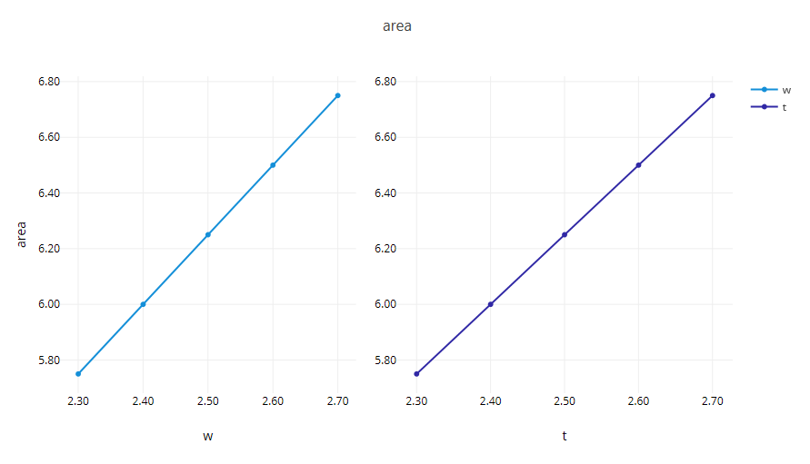

# Summary

This example demonstrates the **responseCompare** composite plotter node from Next-Gen Workflow, a graphical workflow building tool included with Dakota GUI.  

The responseCompare node compares the variability of Dakota's input variables against each of Dakota's output responses, using one generated canvas per response.  The studied problem is Dakota's standard cantilever beam example.  The data source is an HDF5 database file.

In this example, a centered parameter study was performed.  The plot shown above is one of several plots generated by the responseCompare node; this particular plot shows the variables *width (w)* and *thickness (t)* plotted against the response *area*.

# About composite plotter nodes

This example uses a "composite plotter" node.  Composite plotter nodes are special nodes that behave somewhat differently than other plotting nodes available in Next-Gen Workflow:

* Whereas all other plot nodes require you to explicitly manage the created plot data (usually by piping the created plot to a "file" node as the final destination), composite plotter nodes generate a multitude of different plot files when they are executed.  As such, these nodes manage their own file creation process, and do not have output ports.
* These nodes specifically require Dakota-generated HDF5 files as the inputted source of plotting data.  These nodes will not work with general HDF5 files, nor will they work with other types of Dakota output files.
* Composite plotters are context-sensitive to the type of Dakota study that was run.  In other words, the "responseCompare" node will not arbitrarily work with all types of Dakota HDF5 files.

Composite plotter nodes are available in the **Data Visualization (Dakota/Chartreuse Composite Plots)** folder within the Next-Gen Workflow node palette:

 
# Description of the model

A cantilever beam can be thought of as a rigid structural element that extends horizontally and is supported at only one end.

The cantilever beam model has seven input parameters:

 - the length of the beam, **L**
 - the width of the beam, **w**
 - the thickness of the beam, **t**
 - Young's modulus, **E**
 - the density of the beam, **p**
 - the horizontal load on the beam, **X**
 - the vertical load on the beam, **Y**

The cantilever beam model produces three output responses:

 - the **area** of the beam
 - the **stress** on the beam
 - the **displacement** of the beam

# Contents

- `"results" folder` - an example set of previously-generated plots, which are viewable within Dakota GUI.
- `ResponseCompare.iwf` - a workflow file that extracts data from dakota_results.h5 and creates a scatter plot.
- `dakota_cantilever_examples.s1.in` - The original Dakota study file from which we generated the HDF5 database.
- `dakota_cantilever_examples.s1.h5` - The original HDF5 database file that contains the results of the Dakota study.

# How to create new plots

- Open Dakota GUI.
- Import this example into your workspace.
- Double-click ResponseCompare.iwf.

Note that there is no need to configure the responseCompare node before running (although there are a number of useful configuration options available for each composite plotter node).  The composite plotter node will automatically iterate through your HDF5 file and produce the appropriate number of plots to represent your Dakota study data.

- Click on one of the two green play buttons in the action ribbon:

The left play button allows you to define a custom location for running the workflow, while the right play button will run the workflow in the default location, which is a directory called "ResponseCompare", located in the same parent directory as ResponseCompare.iwf.

- After running, a new "ResponseCompare" directory will be created.  This workflow will generate a number of .plot files in your workflow's run directory - one .plot file per response.

Open one of these .plot files to view a strip of plot canvases displaying the explored variable values for that response.  There will be one canvas per Dakota variable.

# Further Reading

- [Read in the Dakota GUI manual about other types of plots that can be produced.](https://dakota.sandia.gov/content/chartreuse-1)
- [Read about how to produce HDF5 files using Dakota.](https://dakota.sandia.gov/content/hdf-0)
- To learn more about an individual node in Next-Gen Workflow, use the built-in help files by clicking on a node, then clicking on the question mark icon in the Settings Editor view.