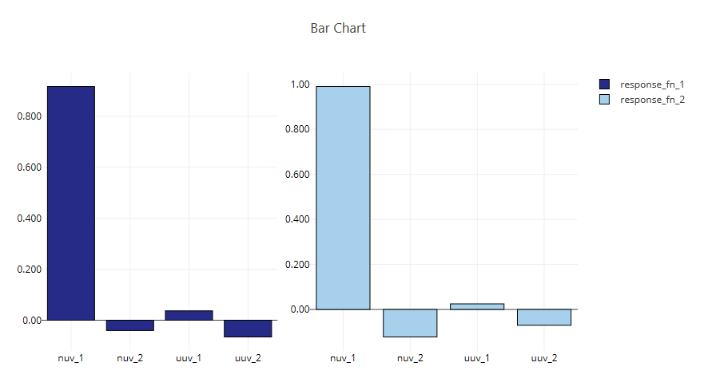
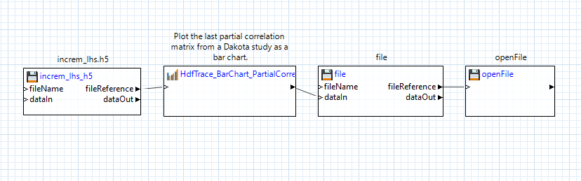

# Summary

This example demonstrates a bar chart of data from an LHS (Latin hypercube) study from Dakota.  The bar chart was produced with Next-Gen Workflow (a tool provided in Dakota GUI) using an HDF5 database.

 
# Description

After running a Dakota LHS study and producing an HDF5 dataset file, many useful datasets will be produced.  Among them are correlations between the variables and responses.  The bar chart shown above demonstrates how the Dakota input variables (nuv\_1, nuv\_2, uuv\_1, and uuv\_2) and correlated to the Dakota output responses response\_fn\_1 and response\_fn\_2.

# Contents

- `BarChart.plot` - a previously-generated Chartreuse plot file.  This plot is viewable in Dakota GUI.
- `increm_lhs.h5` - The original HDF5 database file that contains the results of the Dakota study.

# How to run the example

- Open Dakota GUI.
- Import this example into your workspace.
- Double-click the BarChart.plot file to view the plot.

# How to create a new plot

- Open Dakota GUI.
- Import this example into your workspace.
- Double-click BarChart.iwf.
- Click on one of the two green play buttons in the action ribbon:

- The left play button allows you to define a custom location for running the workflow, while the right play button will run the workflow in the default location, which is a directory called "BarChart", located in the same parent directory as BarChart.iwf.
- After running, a new "BarChart" directory will be created, and a new "BarChart.plot" will be located inside.  Additionally, this workflow has been built to automatically open the new plot file as soon as it is generated.

# Further Reading

- [Learn about Dakota's "textbook" function being studied here in User's Manual.](https://snl-dakota.github.io/docs/latest_release/users/usingdakota/examples/additionalexamples.html#textbook)
- [Learn about the incremental LHS method performed in the Dakota study.](https://snl-dakota.github.io/docs/latest_release/users/usingdakota/reference/method-sampling-refinement_samples.html)
- Learn about [simple correlation](https://en.wikipedia.org/wiki/Correlation_and_dependence), [rank correlation](https://en.wikipedia.org/wiki/Rank_correlation), and [partial correlation](https://en.wikipedia.org/wiki/Partial_correlation).
- [Read in the Dakota GUI manual about other types of plots that can be produced.](https://snl-dakota.github.io/docs/latest_release/users/usingdakotagui/chartreuse/Chartreuse.html)
- [Read about how to produce HDF5 files using Dakota.](https://snl-dakota.github.io/docs/latest_release/users/usingdakotagui/output/HDF.html)
- To learn more about an individual node in Next-Gen Workflow, use the built-in help files by clicking on a node, then clicking on the question mark icon in the Settings Editor view.
