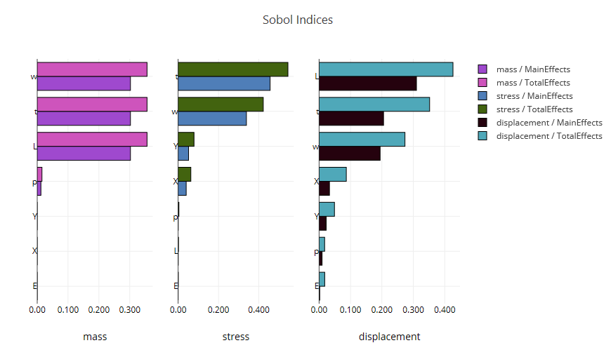
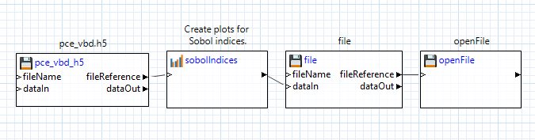

# Summary

This example demonstrates the Sobol indices plot template applied to a cantilever beam model.  The scatter plot was produced with Next-Gen Workflow (a tool provided in Dakota GUI) using an HDF5 dataset.

# Description of the model

A cantilever beam can be thought of as a rigid structural element that extends horizontally and is supported at only one end.

The cantilever beam model has seven input parameters:

 - the width of the beam, **w**
 - the thickness of the beam, **t**
 - the length of the beam, **L**
 - the density of the beam, **p**
 - Young's modulus, **E**
 - the horizontal load on the beam, **X**
 - the vertical load on the beam, **Y**

For this example, the cantilever beam model produces the following output:

 - the **mass** of the beam
 - the **stress** on the beam
 - the **displacement** of the beam

# Description of the method

Variance-based sensitivity analysis attributes response, or output, variance to variability in individual input variables. This approach is also known as the Sobol method, after the Russian mathematician. It is based on a decomposition of the response function f of interest into mutually orthogonal functions of one or more input variables.

For some functions with explicit algebraic form, it is possible to analytically calculate Sobol main and total effects. This is the case for Dakota's orthogonal polynomial models, available through the `polynomial_chaos` method specification. 

# Contents

- `SobolIndices.iwf` - a workflow file that extracts data from dakota_results.h5 and creates a set of bar charts demonstrating Sobol indices.
- `SobolIndices.plot` - a previously-generated plot file.  This plot is viewable in Dakota GUI.
- `pce_vbd.h5` - The HDF5 output that was generated from a polynomial chaos expansion study.

# How to run the example

- Open Dakota GUI.
- Import this example into your workspace.
- Double-click the SobolIndices.plot file to view the plot.

# How to create a new plot

- Open Dakota GUI.
- Import this example into your workspace.
- Double-click SobolIndices.iwf.
- Click on one of the two green play buttons in the action ribbon:

- The left play button allows you to define a custom location for running the workflow, while the right play button will run the workflow in the default location, which is a directory called "SobolIndices", located in the same parent directory as SobolIndices.iwf.
- After running, a new "SobolIndices" directory will be created, and a new "SobolIndices.plot" will be located inside.  Additionally, this workflow has been built to automatically open the new plot file as soon as it is generated.

# Further Reading

- [Read in the Dakota GUI manual about other types of plots that can be produced.](https://dakota.sandia.gov/content/chartreuse-1)
- [Read about Dakota's polynomial_chaos method.](https://dakota.sandia.gov//sites/default/files/docs/latest_release/html-ref/method-polynomial_chaos.html)
- [Read about Sobol indices.](https://en.wikipedia.org/wiki/Variance-based_sensitivity_analysis)
- [Read about how to produce HDF5 files using Dakota.](https://dakota.sandia.gov/content/hdf-0)
- To learn more about an individual node in Next-Gen Workflow, use the built-in help files by clicking on a node, then clicking on the question mark icon in the Settings Editor view.