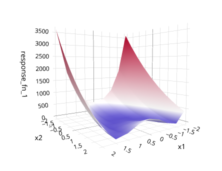
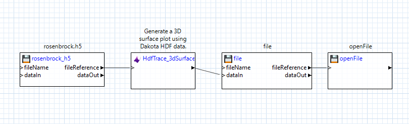

# Summary

This example demonstrates a 3D surface plot of data from Dakota's Rosenbrock example problem.  The surface plot was produced with Next-Gen Workflow (a tool provided in Dakota GUI) using an HDF5 dataset.

# Description

The Rosenbrock curve is a common function used in mathematical optimization as a performance test problem.  The Rosenbrock function can be described as follows:

$` f(x,y) = (a-x)^2 + b(y-x^2)^2 `$

The unique solution to this problem lies at the point (x1, x2) = (1, 1), where the function value is zero.

# Contents

- `SurfacePlot3D.iwf` - a workflow file that extracts data from dakota_results.h5 and creates a 3D surface plot.
- `SurfacePlot3D.plot` - a previously-generated plot file.  This plot is viewable in Dakota GUI.
- `rosenbrock.h5` - The original HDF5 database file that contains the results of the Dakota study.

# How to run the example

- Open Dakota GUI.
- Import this example into your workspace.
- Double-click the SurfacePlot3D.plot file to view the plot.

# How to create a new plot

- Open Dakota GUI.
- Import this example into your workspace.
- Double-click SurfacePlot3D.iwf.
- Click on one of the two green play buttons in the action ribbon:

- The left play button allows you to define a custom location for running the workflow, while the right play button will run the workflow in the default location, which is a directory called "SurfacePlot3D", located in the same parent directory as SurfacePlot3D.iwf.
- After running, a new "SurfacePlot3D" directory will be created, and a new "SurfacePlot3D.plot" will be located inside.  Additionally, this workflow has been built to automatically open the new plot file as soon as it is generated.

# Further Reading

- [Read in the Dakota GUI manual about other types of plots that can be produced.](https://dakota.sandia.gov/content/chartreuse-1)
- [Read about how to produce HDF5 files using Dakota.](https://dakota.sandia.gov/content/hdf-0)
- To learn more about an individual node in Next-Gen Workflow, use the built-in help files by clicking on a node, then clicking on the question mark icon in the Settings Editor view.