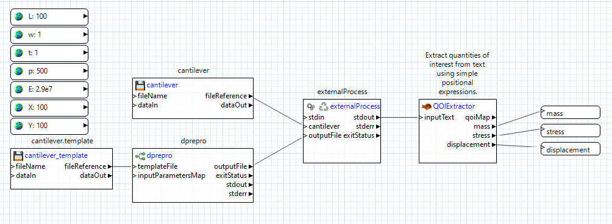

# Summary

This example demonstrates how to submit a Dakota job to a remote, non-queued machine using the Dakota GUI (more specifically, using the Next-Gen Workflow tool within Dakota GUI).

# Description

There are generally two types of remote machines that you can submit Dakota jobs to: non-queued machines and queued machines. As the name implies, non-queued machines have no job queues. They are high-performance machines that you can send Dakota jobs to and run the jobs right away.

For a non-queued remote machine, the high-level approach is as follows:

1. Create a workflow that will be run locally on your machine, and will include a **remoteNestedWorkflow** node, which sends a second workflow to the remote machine. The remoteNestedWorkflow node will include configuration for how to connect to the remote machine (the machine name, credentials, etc.)

2. Create a second workflow that will be run on the remote machine. This workflow should perform whatever computation steps are core to your simulation. (In the diagram above, the remote workflow is running Dakota with an NGW analysis driver, so this results in a third workflow, which must also be sent to the remote machine, but this third workflow is not a prerequisite for a functioning remote workflow.)

3. Finally, run the first workflow on your local machine.

# Contents

- `cantilever` - the simulation model for the cantilever beam physics problem.
- `cantilever.template` - the templatized input for the cantilever beam.
- `CPS.in` - the Dakota study to be run remotely.
- `LocalWorkflow.iwf` - the first of three workflows, which must be run locally on your machine and is responsible for sending the job to the remote machine.
- `RemoteWorkflow.iwf` - the second of three workflows, which will run on the remote machine. This workflow is responsible for starting Dakota and monitoring Dakota's progress.
- `WorkflowDriver.iwf` - the third, innermost workflow, which acts as Dakota's analysis driver. This analysis driver represents the standard Cantilever beam simulation model used for many Dakota examples.

# Some notes before we get started

- A presupposition of this workflow is that the **server/headless version of Next-Gen Workflow is already installed and available on the remote machine.** Talk to your system administrator to ensure that NGW has already been installed on whatever machine you will be submitting your workflow to.
- Login credentials for the remote machine must have already been previously configured. For example, you will not recieve an opportunity to type in your password once the workflow has begun executing. Refer to "Window > Preferences > Connection & Login Preferences" to set your login credentials.

# How to run the example

## Step 1. Configure LocalWorkflow.iwf

After importing this example into the GUI, double-click LocalWorkflow.iwf. You will be presented with a workflow that looks like this:

Note that the connections between the file nodes and the remoteNestedWorkflow node are green. Green lines denote that the File Transfer Behavior of the connection is set to "Copy file to target," since the file must be moved from the local machine to the remote machine.

To change the file transfer behavior, simply click on the connection line and see what the "File Transfer Behavior" property is set to in the Settings view for the connection line.

Now, click on the remoteNestedWorkflow node, and adjust its properties in the Settings view:

- Verify that the "fileName" property is set to "RemoteWorkflow.iwf."
- Set the "hostname" property to the name of the remote machine you will be connecting and sending files to.
- Set the "username" property to your username on the remote machine.
- Set the "remotePath" property to the remote destination which you would like to act as your remote directory.
- Set the "wflib" property to the installation location of headless NGW on the remote machine.

## Step 2. Configure RemoteWorkflow.iwf

Now, double-click RemoteWorkflow.iwf. You will be presented with a workflow that looks like this:

Click on the dakota node, and in the Settings view, set the "dakotaPath" property to the installation location of Dakota on the remote machine.

## Step 3. Configure WorkflowDriver.iwf

Now, double-click WorkflowDriver.iwf. You will be presented with a workflow that looks like this:

Click on the dprepro node, and in the Settings view, set the "dpreproPath" property to the installation location of Dakota on the remote machine.

## Step 4. Run

Once you have configured your workflow files, you are ready to run the workflow! With LocalWorkflow.iwf open in the editor, click one of the two green play buttons in the toolbar ribbon along the top of the GUI to start the first workflow.

# Remote file retrieval

To send remote files back to your local machine after the entire workflow has completed execution, you will need to create output ports and response nodes for each file or folder you want to bring back. Additionally, you will need to do this at every "level" of the workflow, starting from the point at which the files originate. Finally, you will need to set all this up *before* you run the workflow, not afterwards.

Let's assume we want to get Dakota's tabular data file. Because Dakota runs on a remote machine, we will need to retrieve the tabular data file from the remote machine. But how do we do that? Well, because it is the Dakota process that generates this output file, we can use the "Grab Output File" option on the "dakota" node, which is located in the "RemoteWorkflow.iwf" workflow.

Right-click the "dakota" node and choose "Grab Output File" from the context menu. You will be presented with the following dialog:

Enter "tabular\_data\_file" (or something similar) in the "Port name" field, and "tabular.data" in the "File name" field, as "tabular.data" is the name that Dakota uses for its tabular data output in this example.

Click OK on this dialog, which will result in a new output port, "tabular\_data\_file," being added to your "dakota" node. Now, pass the data from this output port to a response node, like so:

Doing all this will result in the *path to the tabular data file* being provided as an output response of the "RemoteWorkflow.iwf" workflow. This is all well and good, but we still need to send the file back to our local machine.

Back in the "LocalWorkflow.iwf" workflow, manually add an output port to "remoteNestedWorkflow" node using the Output Ports tab in the Settings editor (there is no need to use the "Grab Output File" shortcut dialog here). This new output port should be called "tabular\_data\_file" (it should mirror the response node we set up in the other workflow). As before, pass the data from this output port to a response node:

Now, when you run this workflow to completion, Dakota's tabular data file will be returned to your local machine. You can follow this same process for any of Dakota's output files.