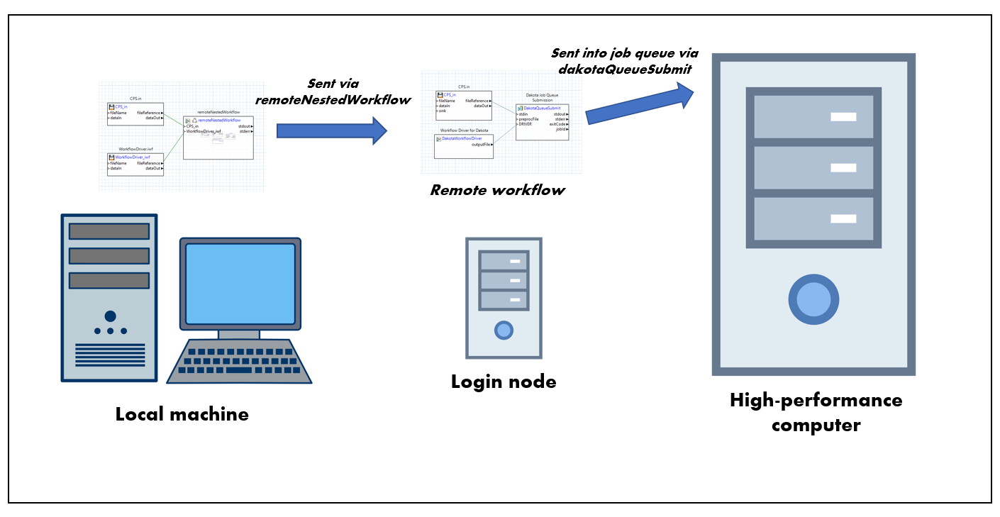

# Summary

This example demonstrates how to submit a Dakota job to a remote machine with a job queue, using the Dakota GUI (more specifically, using the Next-Gen Workflow tool within Dakota GUI).

Additionally, this example uses a dispatchAndCollect node to demonstrate asynchronous job submission using Dakota and NGW. With asynchronous job submission, you can submit your jobs to remote machines and allow Dakota to exit early, then collect the results later.

# Description

There are generally two types of remote machines that you can submit Dakota jobs to: non-queued machines and queued machines. As the name implies, queued machines have job queues. On a queued machine, you must submit your job into the queue and wait your turn to use the high-performance resources:

For the example of submitting a Dakota job to a remote queued machine, you will be creating at least two workflows, as pictured above. The first workflow will run locally on your machine, and its primary responsibility will be uploading files and starting the remote process for NGW, using a **remoteNestedWorkflow** node.

The secondary workflow submitted by the remoteNestedWorkflow node will arrive at a staging area called **the login node.** This is not the appropriate place to perform the job, especially if the job requires heavy-duty computation. Some part of this secondary workflow (either itself or a sub-workflow) must itself be smart enough to submit work into a **job queue.** The work submitted to the job queue will then wait in line with other jobs waiting to use that machine.

Once it is your job's turn, the actual work will be performed. After this, the results can be transferred back to your local machine for review.

Now, the second workflow in this example does not actually perform the job submission. Rather, this is handled by a third workflow, which uses the **dispatchAndCollect** node. The dispatchAndCollect node performs the actual job submission. On the first run of this workflow, this workflow will return dummy values back to Dakota. However, on subsequent runs, this workflow will return the actual values back to Dakota, assuming that the jobs have all finished running.

To summarize, the basic approach is as follows:

1. Create a workflow that will be run locally on your machine, and will include a **remoteNestedWorkflow** node, which sends a second workflow to the queued machine's login node. The remoteNestedWorkflow node will include configuration for how to connect to the remote machine login node (the machine name, credentials, etc.)
2. Create a second workflow that will be run on the login node of the queued machine, and will include a **dakota** node. Your Dakota node should invoke the third workflow...
3. Create a third workflow that uses a **dispatchAndCollect** node. This workflow is Dakota's analysis driver, and is responsible for performing the actual job submission. 
3. Review the scripts that the dispatchAndCollect node governs and validate that they are appropriately written for your environment.

# Contents

- `cantilever` - the simulation model for the cantilever beam physics problem.
- `cantilever.template` - the templatized input for the cantilever beam.
- `CPS.in` - the Dakota study to be run remotely.
- `LocalWorkflow.iwf` - the first of four workflows, which must be run locally on your machine and is responsible for sending the job to the remote machine.
- `LoginNodeWorkflow.iwf` - the second of four workflows, which will run on the login node. This workflow is responsible for starting Dakota on the login node.
- `DispatchAndCollect.iwf` - the third of four workflows, which asynchronously dispatches jobs, or alternately, collects results from previous jobs. This workflow is not directly called by either LoginNodeWorkflow.iwf or LoginNodeWorkflow.iwf, but is called by Dakota.
- `WorkflowDriver.iwf` - the fourth, innermost workflow, which acts as the job submitted to the queue. This job represents the standard Cantilever beam simulation model used for many Dakota examples. 

# Some notes before we get started

- A presupposition of this workflow is that the **server/headless version of Next-Gen Workflow is already installed and available on the remote machine.** Talk to your system administrator to ensure that NGW has already been installed on whatever machine you will be submitting your workflow to.
- Login credentials for the remote machine must have already been previously configured. For example, you will not recieve an opportunity to type in your password once the workflow has begun executing. Refer to "Window > Preferences > Connection & Login Preferences" to set your login credentials.