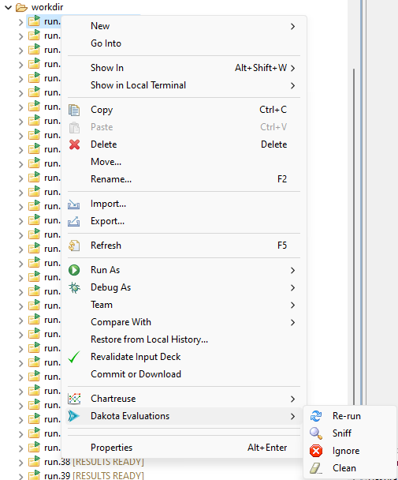

# Summary

This example demonstrates how to run Dakota with a *lazy driver*, which enables asynchronous analysis driver evaluations.

# Description

The concept behind a lazy driver is to allow Dakota to "set and forget" its individual evaluations.

- A lazy driver performs no calculations of its own, but simply wraps itself around the actual analysis driver which performs all the work. In this example, "LazyDriver.py" is the lazy driver (obviously), while "DakotaDriver.py" is the driver that does all the real work. 
- With a lazy driver, once Dakota has spun up separate analysis driver processes for each evaluation, Dakota will exit early, returning **NaN** values in place of the final evaluations. At a later stage, the user is able to re-run Dakota, and, thanks to the logic built in to the lazy analysis driver, each previously calculated evaluation will be picked up without re-running the analysis driver calculations required to arrive at that value.
- The most beneficial use case for lazy analysis drivers is for evaluations that take an exceedingly long time to run. Lazy analysis drivers can also be used in conjunction with remote job submission, if remote high-performance computers must be used to complete the calculations.
- Here, our lazy driver is written in Python, but the Dakota GUI supports lazy analysis drivers written in Python, Bash, or IWF (Next-Gen Workflow) format (see the "New Lazy Driver" wizard in the GUI).

# Contents

- `cantilever` - the black-box simulation model representing the cantilever beam. The Cantilever beam simulation model is not the focus of this model, and is thus not covered here.
- `cantilever.template` - the template input file for the cantilever beam.
- `dakota_cantilever_center.in` - the Dakota study, which uses the `centered_parameter_study` method to study the cantilever beam model. Note that the input file is already configured to invoke `LazyDriver.py`.
- `DakotaDriver.py` - the Python analysis driver.  This Python script is responsible for invoking the cantilever beam simulation model with the parameter sweep values provided by Dakota.
- `LazyDriver.py` - the lazy analysis driver for the Dakota study. On the first run, this Python script is responsible for spinning up separate processes for `DakotaDriver.py` and then allowing Dakota to exit early. On subsequent runs, this driver will return previously calculated values to Dakota immediately.
- `LazyDriver.py.im` - The "interface manifest" for `LazyDriver.py`. Interface manifests are GUI-only concepts, so don't spend too much time worrying about it here.
- `LazyDriver.py.recipe` - The "recipe" file which allows the GUI to reconstruct the original `LazyDriver.py` file without re-running the wizard. Again, don't worry too much about this file - it is mostly for the GUI, not users.

# How to run the example

While this example can be run on the command-line with a quick `dakota dakota_cantilever_center.in`, we recommend running this example from the Dakota GUI to take advantage of the GUI's visual information and restart capabilities.

## Prerequisites (IMPORTANT!)

- This analysis driver will *only* work if Dakota's Python interfacing libraries are available on the **PYTHONPATH** environment variable. OS-specific instructions for setting this variable are provided [here](https://snl-dakota.github.io/docs/latest_release/users/setupdakota.html#setting-your-environment).
- The Python drivers and cantilever scripts all require Python 3.

## Run in Dakota GUI

To immediately run a Dakota input file with reasonable default settings, right-click on your Dakota study, then select "Run As > Dakota."

If you need to more finely tune your Dakota run configuration (not required for this example), see all of the run configuration options available [here](https://snl-dakota.github.io/docs/latest_release/users/usingdakotagui/running/DakotaRunConfiguration.html).

## What to expect on the first run

Shown below is a Dakota working directory midway through generating evaluation results:

While Dakota is running, you will see one of the following statuses next to each evaluation directory:

- [RUNNING] : Indicates that the driver is still running in this evaluation directory
- [RESULTS READY] : Indicates that the driver has finished, but Dakota needs to be started a second time in order to collect the results out of each directory
- [SUCCESSFUL] : Indicates that the driver has finished and Dakota has collected the results
- [FAILED] : Indicates that the driver failed to generate results
- [IGNORED] : Indicates that the user has manually elected to ignore this evaluation directory (see below for more information)

Note that at the end of your first run, this example will generate a tabular data file ("dakota_tabular.dat"), but all of the response values will be "nan". This is to be expected.

## What to do next

In order to collect all your results, you must run Dakota a second time. If everything runs successfully, two things should happen:

- All of the run directories underneath "workdir" should change from a [RESULTS READY] to a [SUCCESSFUL] status.
- The tabular data file will be rewritten with the actual results from the centered parameter sweep. 

# Other things you can do with lazy drivers

## "Dakota Evaluations" context menu

For a Dakota study which has been set up to use a lazy driver, you can navigate into the working directory, right-click on any evaluation folder, and use the “Dakota Evaluations” context menu:

There are several useful options on this menu that are worth going into detail on:

- **Re-run**: This is by far the most useful option on the context menu. Like the name implies, “Re-run” will re-run Dakota, but will only re-run it for one evaluation. (Technically, Dakota will re-run all of its evaluations, but it will hold the results of other directories steady and only re-evaluate the currently selected directory). This option can also be used in batch if you select more than one evaluation.
- **Sniff**: “Sniff” will show you the input parameters and output results of this individual evaluation in a pop-up dialog. This can save you some time spent digging through logs and result files and give you a high-level view of what happened on this evaluation. This option can NOT be used in batch.
- **Ignore**: Selecting “Ignore” will allow you to manually tell Dakota to NOT re-run this evaluation on subsequent re-runs. This can be useful if the input data to a single evaluation results in undesirable behavior from the analysis driver, yet it is too expensive to re-run the evaluation, or too expensive to provide a new set of input parameters and regenerate the other evaluations. This option can be used in batch.
- **Clean**: Selecting “Clean” will delete all of the status metadata in the individual evaluation directory. This option can be useful if the GUI’s view into the evaluation directory has gotten into a bad state and needs to be wiped out. Note that files related to the driver itself are not deleted, and so the ultimate behavior of the driver may be dependent on what it finds in this directory when you later select the “Re-run” option for this evaluation, or re-run the entire study. If you wish to start from a blank slate, it is often better to manually delete the contents of the evaluation directory yourself. This option can be used in batch.

## Shortcomings

Lazy drivers are intended to be run with Dakota studies whose parameter inputs do not depend on the results of previous batches of Dakota evaluations. Therefore, lazy drivers are best used with parameter sweep and UQ methods. They are not suited for optimization-type studies, and we do not currently have any facilities in Dakota GUI to assist with an asynchronous evaluation strategy for studies that require parameter/response feedback.