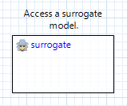
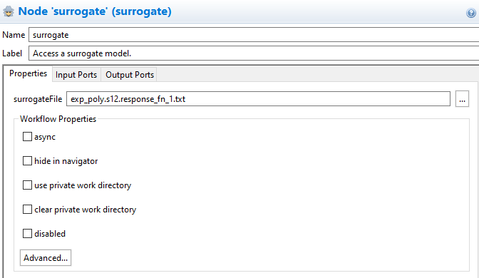
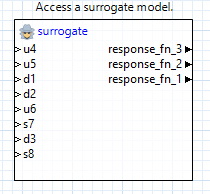
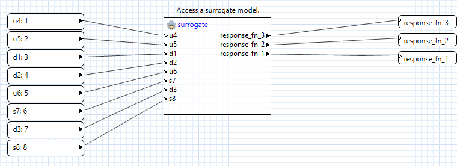

# Summary

Surrogate models are inexpensive approximate models intended to capture the salient features of an expensive high-fidelity model. They can be used to explore the variations in response quantities over regions of the parameter space, or they can serve as inexpensive stand-ins for optimization or uncertainty quantification studies.

# Contents

- `linux` - Surrogate .bin and .txt files for use on Unix (Mac or Linux) machines.
- `windows` - Surrogate .bin and .txt files for use on Windows machines.

# How to run the example

The Dakota GUI supports replacing components of NGW workflows with Dakota-generated surrogates files. To do this, drag a "surrogate" node onto the canvas (from the Dakota folder in the Palette).

A new surrogate node will have no input or output ports until we associate it with a surrogate file. Open the Settings Editor for the node and select a Dakota surrogate file (both .bin and .txt formats are supported).

After selecting the surrogate, the node will auto-create the necessary input and output ports to interface with the surrogate as part of a workflow.

# Further reading

To learn more about Dakota surrogates, consult the [primary documentation on surrogates in Dakota](https://snl-dakota.github.io/docs/latest_release/users/usingdakota/inputfile/model.html#models-surrogate).