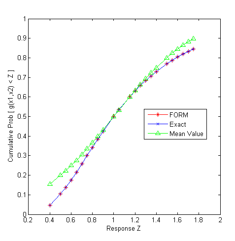

# Summary
Estimate statistics such as the CDF using local optimization (the first-order reliability method)

### Run Dakota

   `dakota -i logratio_uq_reliability.in -o logratio_uq_reliability.out`
 

# What problem does this solve?

This example estimates the probability, reliability, and generalized
reliability levels corresponding to user-specified response levels
of the “log ratio” response function:

$`\qquad \qquad g(x1, x2) = \frac {x1} {x2}`$

where x1 and x2 are identically distributed lognormal random variables
with means of 1, standard deviations of 0.5, and correlation
coefficient of 0.3.

# What method will we use?

The `local_reliability` method can be a more cost-effective way to
estimate statistics, especially low-probability events, than
random sampling. With the `mpp_search` option, Dakota employs constrained
local optimization to search for the "most probable point" of "failure".
With the `no_approx` sub-option, the optimization is performed directly
on the simulation. This is generally the most costly but also the most
accurate way to perform the search. The Reference Manual describes various
approximations Dakota can make to reduce the expense of the search.

It should be noted that Dakota must perform a separate optimization for
each response, probability, reliability, and generalized reliability
level that the user requests. Also, because the method employs local
optimization, the result can depend on the initial point and significant
errors can occur for multi-modal failure surfaces. 

(To modify this example to use the mean value method, see
[Local Relaiability - Mean Value] example(../local_reliability_mean_value/README.md)
## Analysis Driver

Built-in Dakota driver, `log_ratio`. 

### Inputs

The driver takes two continuous inputs.

### Outputs

The driver returns one output.

# Interpret the results
 
## Screen Output

The resulting cumulative distribution function for this input is shown below, with
probability and reliability levels listed for each response level.

```txt
Cumulative Distribution Function (CDF) for response_fn_1:
     Response Level  Probability Level  Reliability Index  General Rel Index
     --------------  -----------------  -----------------  -----------------
   4.0000000000e-01   4.7624085962e-02   1.6683404020e+00   1.6683404020e+00
   5.0000000000e-01   1.0346525475e-01   1.2620507942e+00   1.2620507942e+00
   5.5000000001e-01   1.3818404972e-01   1.0885143628e+00   1.0885143628e+00
   6.0000000000e-01   1.7616275822e-01   9.3008801339e-01   9.3008801339e-01
   6.5000000000e-01   2.1641741368e-01   7.8434989944e-01   7.8434989944e-01
   7.0000000000e-01   2.5803428381e-01   6.4941748143e-01   6.4941748143e-01
   7.5000000000e-01   3.0020938124e-01   5.2379840558e-01   5.2379840558e-01
   8.0000000000e-01   3.4226491013e-01   4.0628960782e-01   4.0628960782e-01
   8.5000000000e-01   3.8365052982e-01   2.9590705956e-01   2.9590705956e-01
   9.0000000000e-01   4.2393548232e-01   1.9183562480e-01   1.9183562480e-01
   1.0000000000e+00   5.0000000000e-01   9.4642463420e-12   9.4642813228e-12
   1.0500000000e+00   5.3539344228e-01  -8.8834907167e-02  -8.8834907167e-02
   1.1500000000e+00   6.0043460094e-01  -2.5447217462e-01  -2.5447217462e-01
   1.2000000000e+00   6.3004131827e-01  -3.3196278078e-01  -3.3196278078e-01
   1.2500000000e+00   6.5773508987e-01  -4.0628960782e-01  -4.0628960782e-01
   1.3000000000e+00   6.8356844630e-01  -4.7770089473e-01  -4.7770089473e-01
   1.3500000000e+00   7.0761025532e-01  -5.4641676380e-01  -5.4641676380e-01
   1.4000000000e+00   7.2994058691e-01  -6.1263331274e-01  -6.1263331274e-01
   1.5000000000e+00   7.6981945355e-01  -7.3825238860e-01  -7.3825238860e-01
   1.5500000000e+00   7.8755158269e-01  -7.9795460350e-01  -7.9795460350e-01
   1.6000000000e+00   8.0393505584e-01  -8.5576118635e-01  -8.5576118635e-01
   1.6500000000e+00   8.1906005158e-01  -9.1178881995e-01  -9.1178881995e-01
   1.7000000000e+00   8.3301386860e-01  -9.6614373461e-01  -9.6614373461e-01
   1.7500000000e+00   8.4588021938e-01  -1.0189229206e+00  -1.0189229206e+00
```

The figure below shows that FORM compares favorably to an exact analytic
solution for this problem. Also note that FORM does have some error in
the calculation of CDF values for this problem, but it is a very small
error (on the order of 1e-11), much smaller than the error obtained
when using a Mean Value method. See the local_reliability_mean_value example
for a discussion of differences.


