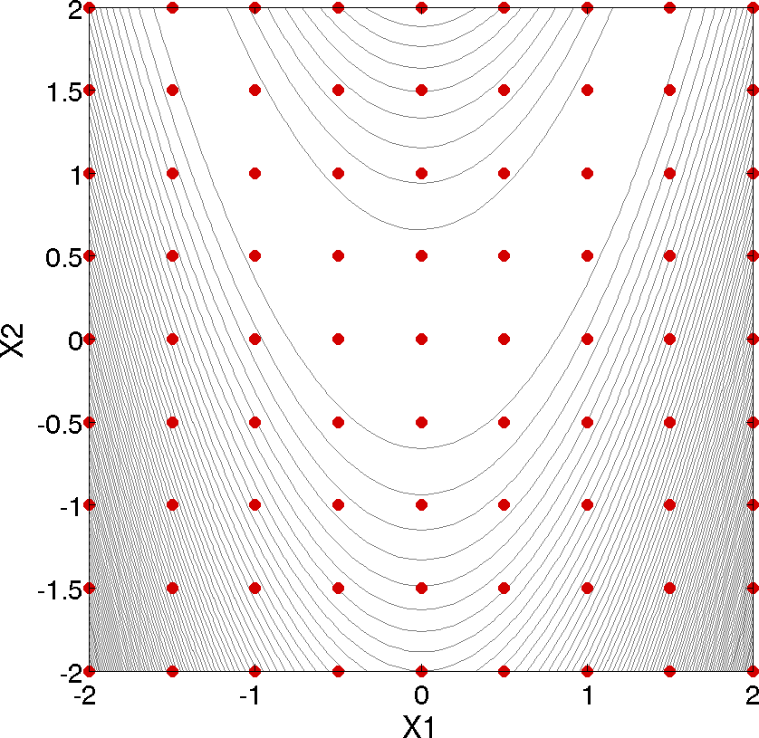
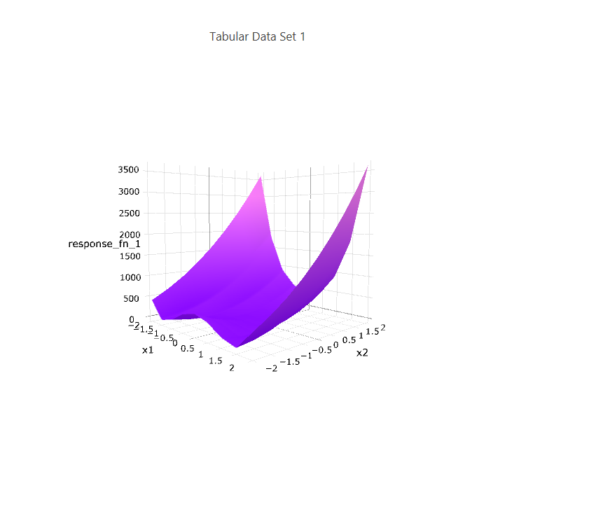
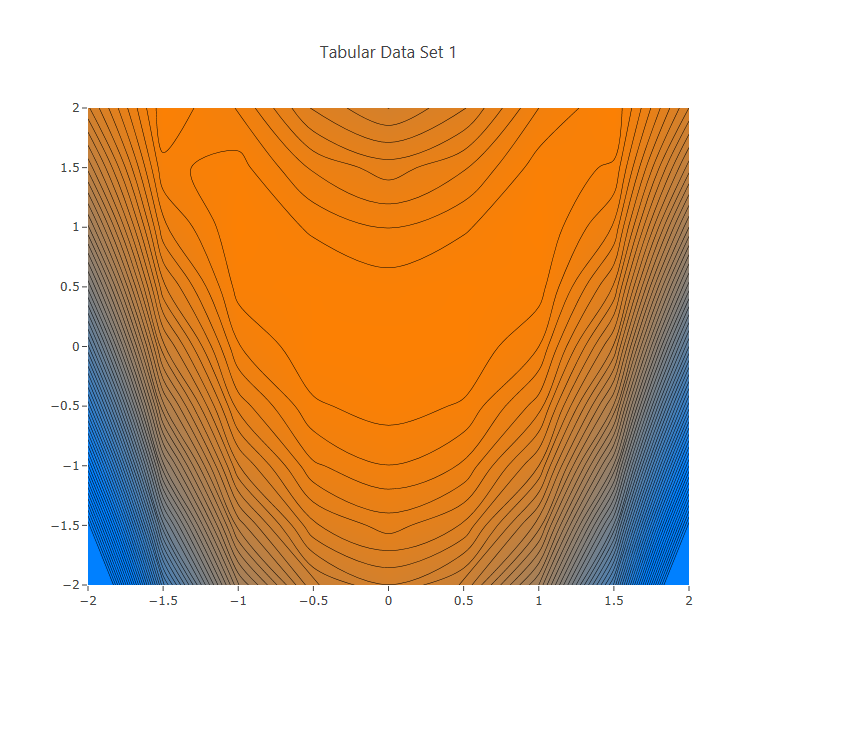
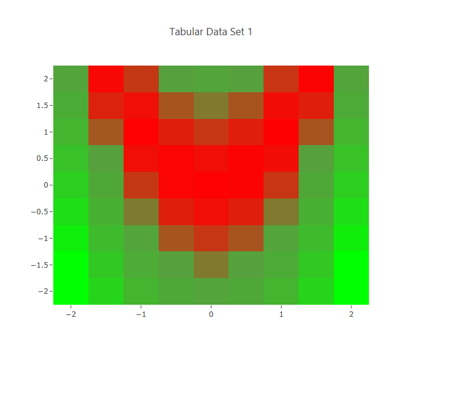

# Summary
This example demonstrates a multi-dimensional parametric exploration of the Rosenbrock curve.

# Description
The Rosenbrock curve is a common function used in mathematical optimization as a performance test problem.  The Rosenbrock function can be described as follows:

$` f(x,y) = (a-x)^2 + b(y-x^2)^2 `$

The unique solution to this problem lies at the point (x1, x2) = (1, 1), where the function value is zero.

We will use the Dakota method _multidim\_parameter\_study_ to explore this function.  In general, a multidimensional parameter study lets one generate a grid in multiple dimensions.
 - The keyword _multidim\_parameter\_study_ indicates that a grid will be generated over all variables.
 - The keyword _partitions_ indicates the number of grid partitions in each dimension. For this example, the number of the grid partitions are the same in each dimension (8 partitions).  It would be possible to specify uneven partitions (for example, _partitions = 8 2_ would indicate only two partitions over the second input variable).

# How to run the example

    $ dakota -i rosen_multidim.in -o rosen_multidim.out

### Notes
 - The Rosenbrock function is packaged with Dakota, so this example uses a direct driver to directly connect to the Rosenbrock function as the analysis driver.  As mentioned earlier, the Rosenbrock receives two input variables - x1 and x2 - which represent x,y coordinates in
three-dimensional space.  The Rosenbrock function outputs a single scalar quantity - response\_fn\_1 - which represents the value of the curve
at the point specified by (x1, x2)
 - The output of the Dakota run is written to the file named rosen\_multidim.out.  In addition, because of the specifications of the keywords tabular\_data and tabular\_data\_file, the grid of points discovered by the multidim\_parameter\_study method will be written to a tabular data file called 'rosen_multidim.dat,' which can then be read by graphical plotting software for visualizing the curve.

This 2-D parameter study produces the grid of data samples shown below.

# Contents

* `rosen_multidim.in`: Dakota input for multidimensional parameter study of the Rosenbrock curve
* `img`: A folder containing images of Dakota's representation of the Rosenbrock curve (see below).

# Screen Output

_Rosenbrock 2-D parameter study example: location of the design points (dots) evaluated_

---

_A 3-D surface representing the Rosenbrock curve, generated using points collected by this Dakota study._

---

_A contour plot representing the Rosenbrock curve, generated using points collected by this Dakota study._

---

_A heat map representing the Rosenbrock curve, generated using points collected by this Dakota study._
