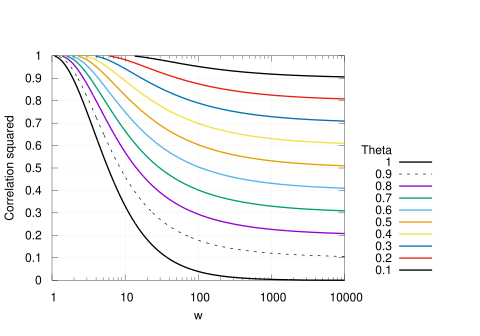

# Summary

Understand how Control Variate Monte Carlo (CVMC) can compute statistics with greater precision and lower cost than ordinary Monte Carlo and learn how to configure a Dakota study to use this approach

# Description

This example is part of a longer tutorial that covers Dakota's multilevel and multifidelity sampling approaches. The top-level page, which provides an outline and describes the test problem used throughout the tutorial, is [here](../README.md). In this section, control variate monte carlo sampling is used to estimate the expectation (mean) of a model QoI. Comparison is made to results obtained using plain [Monte Carlo](../mc).

At the end of this section, the user should understand the basic theory that underlies Control Variate Monte Carlo, and undestand how to configure a Dakota study to perform CVMC.

# Theory Highlights

A control variate MC (CVMC) estimator is based on a low fidelity model
to reduce the variance of the HF MC estimator, thus avoiding to increase
the number of realizations $`N`$ of the HF model. This estimator has been
introduced by [\[1, 2, 3\]](#references) and it is also an
instance of the Approximate Control Variate (ACV) introduced in
[\[4\]](#references). The CVMC estimator is written as

```math
\hat{Q}^{CV} = \frac{1}{N} \sum_{i=1}^N Q^{(i)} + \alpha \left( \frac{1}{N} \sum_{i=1}^N Q_{LF}^{(i)} - \frac{1}{rN} \sum_{i=1}^{rN} Q_{LF}^{(i)} \right),
```

where $`N`$ indicates the number of HF simulations and $`r N`$ the total
number of LF simulations. It is important to note that first $`N`$ LF
simulations are common with the HF model because it allows to compute
the correlation $`\rho`$ between HF and LF. It can be demonstrated that
the optimal oversampling ratio $`r`$ is a function of the correlation and
the cost ratio between the two models, *i.e.*
$`\mathcal{C}_{HF}/\mathcal{C}_{LF}`$

```math
r = \sqrt{ \frac{\mathcal{C}_{HF}}{\mathcal{C}_{LF}} \frac{\rho^2}{1-\rho^2}},
```

and the variance of the estimator is

```math
{\mathbb{V}ar\left[\hat{Q}^{CV}\right]} = \frac{ {\mathbb{V}ar\left[Q\right]} }{ N } \left( 1 - \frac{r-1}{r} \rho^2 \right),
```

which corresponds to a precise choice of
$`\alpha = -\rho \dfrac{{\mathbb{V}ar^{1/2}\left[Q\right]}}{{\mathbb{V}ar^{1/2}\left[Q_{LF}\right]}}.`$

The number of HF simulations that the algorithm needs to run is a
function of the desired target variance for the estimator,
$`\varepsilon^2`$, and the variance reduction that can be obtained from
the LF
```math
N = \frac{ {\mathbb{V}ar\left[Q\right]} }{ \varepsilon^2 } \left( 1 - \frac{r-1}{r} \rho^2 \right).
```

Finally, in order to evaluate the total cost of a multifidelity MC
estimator, it is necessary to sum the cost invested in the HF model and
the cost invested in the LF model
```math
\mathcal{C}_{tot} = N \mathcal{C}_{HF} + r N \mathcal{C}_{LF}.
```

Dakota currently does not support multiple LF models for
this setup, but this capability will be available in the near future
with the implementation of ACV schemes.

The efficiency of a multifidelity estimator, defined as the
computational cost reduction to obtain a prescribed accuracy with
respect to a single fidelity MC estimator, can be defined as the ratio
between the cost of MC and the cost of CVMC to reach the same variance
$`\varepsilon^2`$.

The contour lines for this ratio, called $`\Theta`$ here, are shown in
the following figure as a function of the cost ratio $`w = \dfrac{\mathcal{C}_{HF}}{\mathcal{C}_{LF}}`$ and the correlation squared. 
A ratio $`\Theta`$ lower than 1 indicates that CVMC cost less than MC
to obtain the same accuracy.



# Input Configuration

For this case we select the cheapest LF model, which is using
$`N_{mod} = 3`$ and $`N_x=5`$ (see the table at the bottom of the [problem description](../README.md#test-problem-description)). All methods based on multifidelity require a
cost specification for each model. In this example, we simply consider
the cost of a model as the total number of points needed for a model
evaluation, which is the product $`N_x \times N_{mod}`$.

The main differences of this configuration, with respect to the MC
configuration presented in [the previous section](/..mc) are:

The `method` section points to the `HIERARCH` model, which specifies
a hierarchical sequence of models. The `multifidelity_sampling` method is
selected and configured by specifying the number of pilot samples, the maximum
number of iterations to reach the convergence tolerance and the
convergence tolerance. Dakota currently implements a
relative convergence tolerance strategy that allows the user to
specify the reduction in the variance estimator that needs to be
attained in a control variate estimator (this will be explained in
detail in the postprocessing section);
```
method,
	model_pointer = 'HIERARCH'
      multifidelity_sampling				
	  pilot_samples = 10 seed_sequence = 1237
	  max_iterations = 5
	  convergence_tolerance = 0.01	
	output silent
```


The `HIERARCH` model section specifies the sequence of models with just two fidelities in this case, *i.e.* HF and LF. The two fidelitites are specified by providing, separately, LF and HF, in which the HF model is clearly identified as `truth_model`
```
model,
	id_model = 'HIERARCH'
	variables_pointer = 'HF_VARS'
	surrogate_non_hierarchical
	  unordered_model_fidelities = 'LF' 
	  truth_model = 'HF'
```
The `HF` and `LF` model sections are consistent with the model specification of a MC simulation with the only difference that the
`solution_level_cost` needs to be specified to represent the computational cost, *i.e.* $`N_x \times N_{mod}`$;
```
model,
	id_model = 'LF'
	variables_pointer = 'LF_VARS'
	simulation
	  solution_level_cost = 15.

model,
	id_model = 'HF'
	variables_pointer = 'HF_VARS'
	simulation
          solution_level_cost = 4200.
```
The low- and high-fidelity models each have their own `variables` blocks, which configure the uncertain and and state variables. The latter control the model fidelity, *i.e.* number of spatial nodes and modes. The `HF_VARS` settings match those that were used for the plain [Monte Carlo](../mc) study, in which only the high-fidelity model was studied.
```
variables,
	id_variables = 'LF_VARS'
	uniform_uncertain = 7
	  lower_bounds    = 7*-1.
	  upper_bounds    = 7* 1.
	discrete_state_set
	  integer = 2
	    num_set_values = 1 1
	    set_values = 5 # number of spatial coords
	    	       	 3 # number of Fourier solution modes
	    initial_state = 5 3
	    descriptors 'N_x' 'N_mod'

variables,
	id_variables = 'HF_VARS'
	uniform_uncertain = 7
	  lower_bounds    = 7*-1.
	  upper_bounds    = 7* 1.
	discrete_state_set
	  integer = 2
	    num_set_values = 1 1
	    set_values = 200 # number of spatial coords
	    	       	 21  # number of Fourier solution modes
	    initial_state = 200 21
	    descriptors 'N_x' 'N_mod'
```

In summary, once a new `multifidelity_sampling` method is specified, and the HF model is identified as the `truth_model`, the 
configuration closely follows the one of a MC method with a single model.

# PostProcessing Phase

The MC configuration can be executed with:

`dakota -i dakota_CV.in -o dakota_CV.out`.

We will now follow the execution of the job starting with the pilot
phase. In this phase Dakota evaluates a number of common
samples for both HF and LF in order to derive the statistics needed for
the job execution. By using the pilot samples, Dakota estimates several
quantities: the variance of the HF QoI, $`{\mathbb{V}ar\left[Q\right]}`$,
and the correlation between HF and LF, $`\rho`$. In the output file, the
number of HF and LF evaluations is summarized first, *i.e.*
$`N_{pilot}=10`$ for each model in this case, and, then, few statistics
are reported:

```
NonD random Samples = 10 Seed (user-specified) = 1237
Scaling profile for convergenceTol = 1.0000000000e-02: average HF target = 9.4044130391e+01
```

-   The MC estimator variance is not reported if the `output silent` keyword is used, but it could be retrieved by using `output debug` as
    ```math
	{\mathbb{V}ar\left[ \hat{Q}^{MC} \right]} = {\mathbb{V}ar\left[ Q \right]} / N_{pilot} = 646.671.
	```

-   Similarly, the correlation $`\rho=0.92198`$ (not reported) is used to estimate the oversampling
    ratio $`r = 57.52`$ (not reported) and, from it, the variance
    reduction term is estimated
    ```math
    \left( 1 - \frac{r-1}{r} \rho^2 \right) = 0.094044.
    ```

-   The relative variance reduction requested by the user, `convergence_tolerance`,
    which we can indicate with $`\tau_{target}`$, is compared to the
    variance reduction attained with allocation on the LF model only.
    Since, in this case, `0.094044` $`>`$ `convergence_tolerance`, a full allocation
    problem needs to be solved, *i.e.*
    ```math
    N = \frac{ {\mathbb{V}ar\left[Q\right]} }{ \left( \frac{{\mathbb{V}ar\left[Q\right]}}{N_{pilot}} \tau_{target}  \right) } \left( 1 - \frac{r-1}{r} \rho^2 \right) = 94.044.
    ```

-   If the number of `max_iterations` (input file `method` specification) is greater than
    zero, the algorithm continues with both HF and LF simulations.

```
Non-hierarchical sampling iteration 1: shared sample increment = 84

NonD random Samples = 84 Seed not reset from previous LHS execution
Scaling profile for convergenceTol = 1.0000000000e-02: average HF target = 4.7336977456e+01
```

In this case, we needed a total of $`94`$ HF simulations, but 10 are already
available from pilot, so only additional 84 samples are evaluated for
the two models. After an updated evaluation of the correlation $`\rho`$,
the same statistics described above are evaluated, and, the number of HF simulations needed to satisfy the 
convergence tolerance are computed. This number is reported as `average HF target`. This number is now smaller than the available number of HF runs, therefore the iteration for the HF model is terminated.


At this point, the algorithm needs to evaluate the full set of LF models corresponding to the
evaluated statistics. For this case, the updated correlation value is
$`0.98882`$, which corresponds to an oversampling ratio of $`r = 110.98`$.

The total number of LF evaluations needed is evaluated as the product between $r$ and the `average HF target`, which in this case 
corresponds to a total of 5253 LF runs. Hence, the algorithm needs to compute an additional number of $`5253 - 94`$ LF
evaluations to complete the estimator evaluation:
```
MFMC sample increment = 5159 for approximations [1, 1]
```
After all the iterations, Dakota reports the final number
of evaluations and their equivalent HF cost (with additional statistics for the estimator components)
```
<<<<< Final samples per model form:
      Model Form 1:
                                  5253
      Model Form 2:
                                    94
<<<<< Equivalent number of high fidelity evaluations: 1.1276071429e+02
<<<<< Variance for mean estimator:
      Initial MC (  10 pilot samples):  6.4667099361e+02
      Final   MC (  94 HF samples):     1.0491364498e+02
      Final MFMC (sample profile):      4.1677281280e+00
      Final MFMC ratio (1 - R^2):       3.9725320086e-02
```

In this case we have a total of $`5253`$ LF and $`94`$ HF evaluations. The
total cost is then
```math
\mathcal{C}_{tot} = 94 \times 4200 + 5253 \times 15 = 473595,
```

which corresponds to a total of $`473595 / 4200 = 112.76`$ HF evaluations.

Similarly to the MC case, the final statistics are reported at the end
of the output file
```
Sample moment statistics for each response function:
                            Mean           Std Dev          Skewness          Kurtosis
 response_fn_1  4.1540185792e+01  1.0699164066e+02  2.0255307960e+00  5.7054234756e+00
```
In this case, in order to evaluate the confidence of interval we need to
manually evaluate the estimator variance from the available data. We
first compute the variance of the QoI from the reported standard
deviation: $`106.99^2 = 11447.21`$. From the QoI variance we can evaluate
the estimator variance
```math
{\mathbb{V}ar\left[ \hat{Q}^{CV} \right]} = \frac{{\mathbb{V}ar\left[Q\right]}}{94} \left( 1 - \frac{110.98-1}{110.98} 0.98882^2 \right) = 3.7807.
```

The 99.7% confidence interval can be defined as
$`\hat{Q}^{CV} \pm 3 {\mathbb{V}ar^{1/2}\left[ \hat{Q}^{CV} \right]} = \left[ 35.707, 47.373 \right]`$.
From a comparison between the confidence interval of MC and CVMC, it is
possible to see that CVMC attains a smaller confidence interval than MC
for a total cost that is approximately 9 times smaller ($`113`$ Vs $`1000`$
HF simulations).

# Further Reading

* Reference Manual entry for the 
  [multifidelity_sampling](https://dakota.sandia.gov//sites/default/files/docs/latest_release/html-ref/method-multifidelity_sampling.html)
  method and [non_hierarchical](https://dakota.sandia.gov//sites/default/files/docs/latest_release/html-ref/model-surrogate-non_hierarchical.html)
  surrogate model.
* [User's Manual](https://dakota.sandia.gov/content/manuals) discussion of active variable view in section 9.5.


# References

1. Pasupathy, R., Taaffe, M., Schmeiser, B. W. & Wang, W., Control-variate
   estimation using estimated control means. *IIE Transactions*, **44**(5), 381–385, 2012.
2. Ng, L.W.T. & Willcox, K. Multifidelity Approaches for Optimization Under Uncertainty.
   *Int. J. Numer. Meth. Engng* 100, no. 10, pp. 746–772, 2014.
3. Peherstorfer, B., Willcox, K. & Gunzburger, M., Optimal Model Management for Multifidelity 
   Monte Carlo Estimation. *SIAM J. Sci. Comput.* 38(5), A3163–A3194, 2016.
4. Gorodetsky, A.A., Geraci, G., M.S. Eldred & J. Jakeman, A generalized approximate control
   variate framework for multifidelity uncertainty quantification. *Journal of Comp Phys*, 408, 2020.

---

* Return to the [Outline](../README.md#outline)
* Continue to the [next section](../mlmc) of the tutorial
* Go back to the [previous section](../mc) of the tutorial
